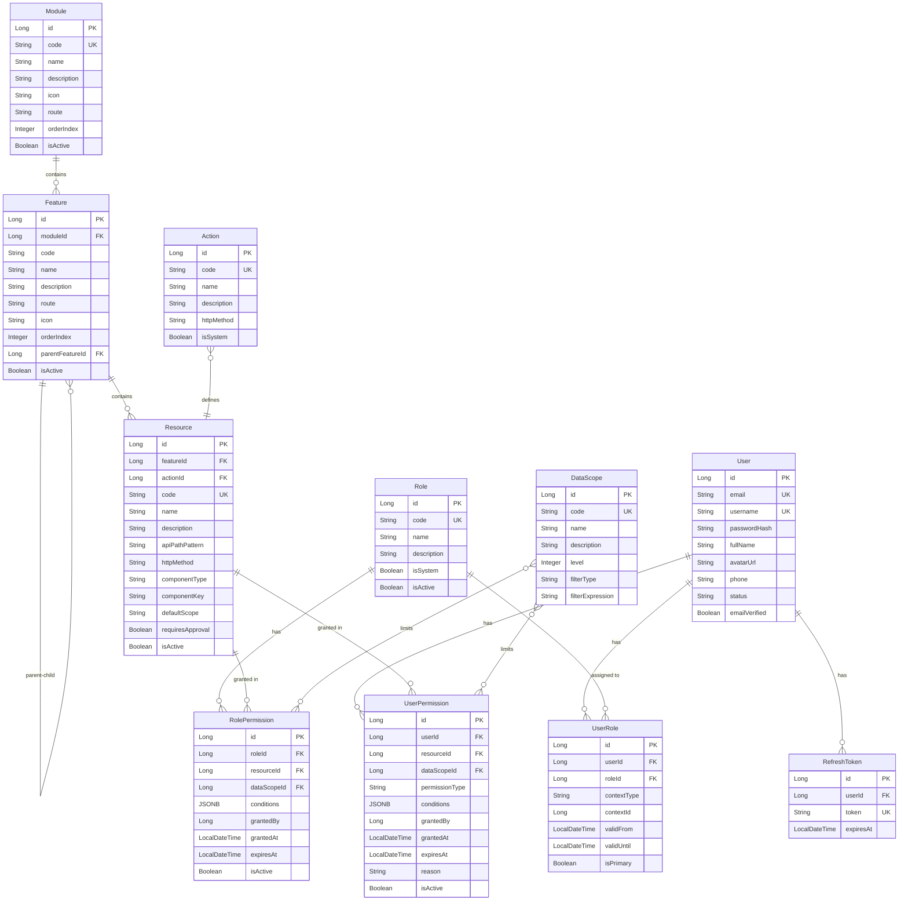

# Tài Liệu Chi Tiết Về Các Entity Trong Hệ Thống Phân Quyền

## Mục Lục

1. [Tổng Quan Hệ Thống](#1-tổng-quan-hệ-thống)
2. [Kiến Trúc RBAC](#2-kiến-trúc-rbac)
3. [Sơ Đồ Quan Hệ Entity](#3-sơ-đồ-quan-hệ-entity)
4. [Chi Tiết Các Entity](#4-chi-tiết-các-entity)
5. [Design Patterns và Rationale](#5-design-patterns-và-rationale)
6. [Hướng Dẫn Sử Dụng](#6-hướng-dẫn-sử-dụng)
7. [Ví Dụ Thực Tế](#7-ví-dụ-thực-tế)

---

## 1. Tổng Quan Hệ Thống

### 1.1. Giới Thiệu

Hệ thống auth-service triển khai một mô hình phân quyền RBAC (Role-Based Access Control) nâng cao với 11 entity chính, được thiết kế để đáp ứng các yêu cầu phân quyền phức tạp trong môi trường doanh nghiệp.

### 1.2. Đặc Điểm Nổi Bật

- **Phân cấp tài nguyên (Resource Hierarchy)**: Module → Feature → Resource
- **Mô hình phân quyền kép (Dual Permission Model)**: Quyền dựa trên Role + Quyền đặc biệt cho User
- **Phân quyền theo ngữ cảnh (Context-Based Permissions)**: Hỗ trợ gán role theo organization, project, team
- **Kiểm soát phạm vi dữ liệu (Data Scope Control)**: OWN, TEAM, DEPARTMENT, ORGANIZATION, ALL
- **Điều kiện linh hoạt (Flexible Conditions)**: Sử dụng JSONB để lưu điều kiện phức tạp
- **Quyền có thời hạn (Temporal Permissions)**: Hỗ trợ validFrom, validUntil, expiresAt

### 1.3. Công Nghệ Sử Dụng

- **Framework**: Spring Boot 3.x với JPA/Hibernate
- **Database**: PostgreSQL với hỗ trợ JSONB
- **ORM**: Jakarta Persistence API (JPA)
- **Annotations**: Lombok để giảm boilerplate code

---

## 2. Kiến Trúc RBAC

### 2.1. Mô Hình RBAC Nâng Cao

```
User ──┬──> UserRole ──> Role ──> RolePermission ──┬──> Resource
       │                                            │
       └──> UserPermission ────────────────────────┘
                                                    │
                                                    ├──> Feature ──> Module
                                                    │
                                                    └──> Action
```

### 2.2. Luồng Kiểm Tra Quyền

```
1. Kiểm tra UserPermission với type = DENY
   └─> Nếu có và còn hiệu lực → TỪ CHỐI ngay lập tức

2. Kiểm tra UserPermission với type = GRANT
   └─> Nếu có và còn hiệu lực → CHO PHÉP với DataScope của UserPermission

3. Kiểm tra RolePermission qua UserRole
   └─> Lấy tất cả role của user (theo context nếu có)
   └─> Kiểm tra RolePermission của từng role
   └─> Nếu có và còn hiệu lực → CHO PHÉP với DataScope của RolePermission

4. Không tìm thấy quyền nào → TỪ CHỐI
```

### 2.3. Phân Cấp Tài Nguyên

```
Module (Quản lý người dùng)
  │
  ├─> Feature (Danh sách người dùng)
  │     │
  │     ├─> Resource (Xem danh sách - READ)
  │     └─> Resource (Xuất Excel - EXPORT)
  │
  └─> Feature (Tạo người dùng)
        │
        └─> Resource (Tạo mới - CREATE)
```

---

## 3. Sơ Đồ Quan Hệ Entity

### 3.1. Entity Relationship Diagram (ERD)



### 3.2. Nhóm Entity Theo Chức Năng

#### Nhóm 1: Identity & Authentication
- **User**: Thông tin người dùng
- **RefreshToken**: Quản lý refresh token cho JWT

#### Nhóm 2: Role Management
- **Role**: Định nghĩa vai trò
- **UserRole**: Gán vai trò cho người dùng (với context)

#### Nhóm 3: Resource Hierarchy
- **Module**: Nhóm tính năng cấp cao
- **Feature**: Tính năng cụ thể
- **Action**: Hành động có thể thực hiện
- **Resource**: Tài nguyên có thể phân quyền

#### Nhóm 4: Permission Management
- **DataScope**: Phạm vi dữ liệu
- **RolePermission**: Quyền của role
- **UserPermission**: Quyền đặc biệt của user

---

## 4. Chi Tiết Các Entity

### 4.1. User Entity

**Mục đích**: Lưu trữ thông tin người dùng và làm điểm trung tâm cho authentication/authorization.

**Bảng database**: `users`

**Kế thừa**: `BaseEntity` (cung cấp id, createdAt, updatedAt, createdBy, updatedBy)

#### Các Trường (Fields)

| Tên Trường | Kiểu Dữ Liệu | Ràng Buộc | Mô Tả |
|------------|--------------|-----------|-------|
| `email` | String(300) | NOT NULL, UNIQUE | Email đăng nhập, phải duy nhất trong hệ thống |
| `username` | String(100) | NOT NULL, UNIQUE | Tên đăng nhập, phải duy nhất |
| `passwordHash` | String | NOT NULL | Mật khẩu đã được hash (BCrypt/Argon2), không bao giờ lưu plain text |
| `fullName` | String(300) | NULLABLE | Tên đầy đủ của người dùng để hiển thị |
| `avatarUrl` | String(500) | NULLABLE | URL ảnh đại diện (có thể là CDN link) |
| `phone` | String(20) | NULLABLE | Số điện thoại liên hệ |
| `status` | String(20) | DEFAULT 'ACTIVE' | Trạng thái tài khoản: ACTIVE, INACTIVE, LOCKED, SUSPENDED |
| `emailVerified` | Boolean | DEFAULT false | Đánh dấu email đã được xác thực chưa |

#### Quan Hệ (Relationships)

```java
@OneToMany(mappedBy = "user", cascade = CascadeType.ALL, fetch = FetchType.LAZY)
private Set<UserRole> userRoles;
```
- **Loại**: One-to-Many
- **Entity liên kết**: UserRole
- **Cascade**: ALL (khi xóa User, xóa tất cả UserRole)
- **Fetch**: LAZY (chỉ load khi cần)
- **Ý nghĩa**: Một user có thể có nhiều role (trong các context khác nhau)

```java
@OneToMany(mappedBy = "user", cascade = CascadeType.ALL, fetch = FetchType.LAZY)
private Set<UserPermission> userPermissions;
```
- **Loại**: One-to-Many
- **Entity liên kết**: UserPermission
- **Ý nghĩa**: Một user có thể có nhiều quyền đặc biệt (GRANT hoặc DENY)

#### Helper Methods

```java
public void addUserRole(UserRole userRole)
```
- Thêm role cho user và maintain bidirectional relationship
- Tự động set `userRole.setUser(this)`

```java
public void removeUserRole(UserRole userRole)
```
- Xóa role khỏi user và break bidirectional relationship
- Tự động set `userRole.setUser(null)`

#### Design Rationale

1. **Tách passwordHash**: Tên field nhấn mạnh không lưu plain text password
2. **Status dạng String**: Dễ mở rộng thêm trạng thái mới mà không cần alter enum
3. **emailVerified**: Hỗ trợ email verification flow (gửi link xác thực)
4. **Unique constraints**: Email và username đều unique để tránh duplicate accounts
5. **Helper methods**: Đảm bảo bidirectional relationship luôn consistent

#### Ví Dụ Sử Dụng

```java
// Tạo user mới
User user = User.builder()
    .email("nguyen.van.a@example.com")
    .username("nguyenvana")
    .passwordHash(passwordEncoder.encode("password123"))
    .fullName("Nguyễn Văn A")
    .phone("0901234567")
    .status("ACTIVE")
    .emailVerified(false)
    .build();

// Thêm role cho user
UserRole userRole = UserRole.builder()
    .role(adminRole)
    .contextType("ORGANIZATION")
    .contextId(orgId)
    .build();
user.addUserRole(userRole);
```

---

### 4.2. RefreshToken Entity

**Mục đích**: Quản lý refresh tokens cho JWT authentication flow, cho phép revoke tokens khi cần.

**Bảng database**: `refresh_tokens`

#### Các Trường (Fields)

| Tên Trường | Kiểu Dữ Liệu | Ràng Buộc | Mô Tả |
|------------|--------------|-----------|-------|
| `user` | User | NOT NULL, FK | User sở hữu token này |
| `token` | String(500) | NOT NULL, UNIQUE | Refresh token string (UUID hoặc JWT) |
| `expiresAt` | LocalDateTime | NOT NULL | Thời điểm token hết hạn |

#### Quan Hệ (Relationships)

```java
@ManyToOne(fetch = FetchType.LAZY)
@JoinColumn(name = "user_id", nullable = false)
private User user;
```
- **Loại**: Many-to-One
- **Ý nghĩa**: Nhiều refresh tokens có thể thuộc về một user (multi-device login)

#### Methods

```java
public boolean isExpired()
```
- Kiểm tra token còn hiệu lực không
- Return: `true` nếu `LocalDateTime.now()` sau `expiresAt`

#### Design Rationale

1. **Lưu trong DB**: Cho phép revoke tokens (logout, security breach)
2. **Unique token**: Tránh token collision
3. **expiresAt**: Tự động invalidate tokens cũ, giảm database bloat
4. **Many-to-One với User**: Hỗ trợ multi-device login

#### Ví Dụ Sử Dụng

```java
// Tạo refresh token
RefreshToken refreshToken = RefreshToken.builder()
    .user(user)
    .token(UUID.randomUUID().toString())
    .expiresAt(LocalDateTime.now().plusDays(30))
    .build();

// Kiểm tra token
if (refreshToken.isExpired()) {
    throw new TokenExpiredException("Refresh token has expired");
}
```

---

### 4.3. Role Entity

**Mục đích**: Định nghĩa các vai trò trong hệ thống (ADMIN, USER, MANAGER, INSTRUCTOR, etc.)

**Bảng database**: `roles`

#### Các Trường (Fields)

| Tên Trường | Kiểu Dữ Liệu | Ràng Buộc | Mô Tả |
|------------|--------------|-----------|-------|
| `code` | String(50) | NOT NULL, UNIQUE | Mã vai trò dùng trong code (ADMIN, USER, MANAGER) |
| `name` | String(100) | NOT NULL | Tên hiển thị của vai trò (Quản trị viên, Người dùng) |
| `description` | Text | NULLABLE | Mô tả chi tiết vai trò và trách nhiệm |
| `isSystem` | Boolean | DEFAULT false | Vai trò hệ thống không được xóa/sửa (SUPER_ADMIN) |
| `isActive` | Boolean | DEFAULT true | Vai trò có đang active không |

#### Quan Hệ (Relationships)

```java
@OneToMany(mappedBy = "role", cascade = CascadeType.ALL, fetch = FetchType.LAZY)
private Set<RolePermission> rolePermissions;
```
- **Loại**: One-to-Many
- **Ý nghĩa**: Một role có nhiều permissions (quyền truy cập các resource khác nhau)

#### Design Rationale

1. **code vs name**: `code` để dùng trong code (constant), `name` để hiển thị UI (có thể đa ngôn ngữ)
2. **isSystem**: Protect các role quan trọng khỏi bị xóa nhầm (SUPER_ADMIN, SYSTEM)
3. **isActive**: Soft disable role thay vì xóa (preserve audit trail)
4. **description**: Giúp admin hiểu rõ vai trò và trách nhiệm

#### Ví Dụ Sử Dụng

```java
// Tạo role mới
Role instructorRole = Role.builder()
    .code("INSTRUCTOR")
    .name("Giảng viên")
    .description("Giảng viên có thể tạo và quản lý khóa học của mình")
    .isSystem(false)
    .isActive(true)
    .build();

// Tạo system role
Role superAdminRole = Role.builder()
    .code("SUPER_ADMIN")
    .name("Quản trị viên cấp cao")
    .description("Có toàn quyền trong hệ thống")
    .isSystem(true)  // Không được xóa
    .isActive(true)
    .build();
```

---

