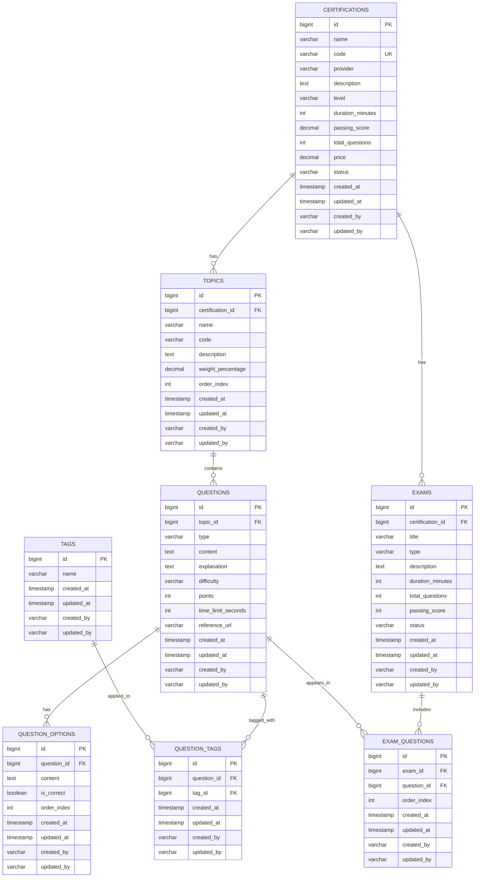

# Tài Liệu Phân Tích Entity - Exam Service

## Mục Lục

1. [Giới Thiệu](#giới-thiệu)
2. [Kiến Trúc Tổng Thể](#kiến-trúc-tổng-thể)
3. [Sơ Đồ Quan Hệ Thực Thể (ERD)](#sơ-đồ-quan-hệ-thực-thể-erd)
4. [Phân Tích Chi Tiết Từng Entity](#phân-tích-chi-tiết-từng-entity)
5. [Mối Quan Hệ Giữa Các Entity](#mối-quan-hệ-giữa-các-entity)
6. [Design Patterns và Conventions](#design-patterns-và-conventions)
7. [Ví Dụ Sử Dụng Thực Tế](#ví-dụ-sử-dụng-thực-tế)
8. [Best Practices và Recommendations](#best-practices-và-recommendations)

---

## Giới Thiệu

### Tổng Quan Về Exam Service

**Exam Service** là một microservice trong hệ thống CertiMaster, chịu trách nhiệm quản lý toàn bộ dữ liệu liên quan đến các chứng chỉ, bài kiểm tra, câu hỏi và nội dung học tập. Service này đóng vai trò trung tâm trong việc cung cấp nền tảng cho người dùng học tập, luyện tập và thi lấy chứng chỉ chuyên nghiệp.

### Mục Đích Của Hệ Thống Entity

Hệ thống entity được thiết kế để:

- **Quản lý chứng chỉ**: Lưu trữ thông tin về các chứng chỉ chuyên nghiệp (AWS, Azure, Kubernetes, v.v.)
- **Tổ chức nội dung**: Phân chia kiến thức thành các chủ đề (topics) có cấu trúc
- **Quản lý ngân hàng câu hỏi**: Lưu trữ và phân loại câu hỏi theo nhiều tiêu chí
- **Tạo bài kiểm tra**: Hỗ trợ tạo các loại bài thi khác nhau (practice, mock, final)
- **Tái sử dụng nội dung**: Cho phép sử dụng lại câu hỏi trong nhiều bài thi
- **Phân loại và tìm kiếm**: Sử dụng hệ thống tags để phân loại câu hỏi

### Vai Trò Của Từng Entity

#### 1. **Certification** (Chứng Chỉ)
**Vai trò**: Entity gốc (root entity) đại diện cho một chứng chỉ hoặc khóa học hoàn chỉnh.

**Chức năng chính**:
- Lưu trữ thông tin tổng quan về chứng chỉ (tên, mã, nhà cung cấp)
- Định nghĩa các thông số kỹ thuật của bài thi (thời gian, điểm đạt, số câu hỏi)
- Quản lý giá cả và trạng thái của chứng chỉ
- Là điểm tập hợp cho tất cả topics và exams liên quan

**Ví dụ thực tế**: AWS Solutions Architect Associate (SAA-C03), Certified Kubernetes Administrator (CKA)

#### 2. **Topic** (Chủ Đề)
**Vai trò**: Đại diện cho một domain kiến thức hoặc phần nội dung trong chứng chỉ.

**Chức năng chính**:
- Phân chia chứng chỉ thành các phần kiến thức có cấu trúc
- Định nghĩa tỷ trọng (weight) của từng phần trong bài thi
- Tổ chức câu hỏi theo chủ đề để dễ quản lý
- Hỗ trợ học tập theo từng domain cụ thể

**Ví dụ thực tế**: 
- Domain 1: Design Resilient Architectures (30%)
- Domain 2: Design High-Performing Architectures (28%)
- Domain 3: Design Secure Applications (24%)

#### 3. **Exam** (Bài Kiểm Tra)
**Vai trò**: Đại diện cho một bài kiểm tra cụ thể thuộc một chứng chỉ.

**Chức năng chính**:
- Tạo các loại bài thi khác nhau (practice, mock, final, diagnostic, topic-wise)
- Tùy chỉnh thời gian và điểm đạt cho từng bài thi
- Quản lý tập hợp câu hỏi cho mỗi bài thi
- Theo dõi trạng thái của bài thi (active, inactive, draft)

**Ví dụ thực tế**:
- Practice Test 1 - AWS SAA (65 câu, 130 phút)
- Mock Exam - Final Preparation (65 câu, 130 phút)
- Topic-Wise Test - Security Domain (20 câu, 40 phút)

#### 4. **Question** (Câu Hỏi)
**Vai trò**: Đại diện cho một câu hỏi trong ngân hàng câu hỏi.

**Chức năng chính**:
- Lưu trữ nội dung câu hỏi và giải thích
- Phân loại theo độ khó (easy, medium, hard)
- Hỗ trợ nhiều loại câu hỏi (single choice, multiple choice, true/false)
- Có thể tái sử dụng trong nhiều bài thi khác nhau
- Liên kết với topic để tổ chức theo chủ đề

**Ví dụ thực tế**: "Which AWS service provides a managed NoSQL database?" (SINGLE_CHOICE, MEDIUM)

#### 5. **QuestionOption** (Đáp Án)
**Vai trò**: Đại diện cho một lựa chọn trả lời của câu hỏi.

**Chức năng chính**:
- Lưu trữ nội dung các đáp án
- Đánh dấu đáp án đúng/sai
- Quản lý thứ tự hiển thị đáp án
- Hỗ trợ nhiều đáp án đúng (cho multiple choice)

**Ví dụ thực tế**:
- A. Amazon RDS (isCorrect: false)
- B. Amazon DynamoDB (isCorrect: true)
- C. Amazon S3 (isCorrect: false)

#### 6. **ExamQuestion** (Bảng Trung Gian Exam-Question)
**Vai trò**: Quản lý mối quan hệ many-to-many giữa Exam và Question.

**Chức năng chính**:
- Cho phép một câu hỏi xuất hiện trong nhiều bài thi
- Quản lý thứ tự câu hỏi riêng cho từng bài thi
- Có thể mở rộng để lưu metadata bổ sung (điểm số riêng, v.v.)

**Ý nghĩa**: Tách riêng bảng trung gian thay vì dùng @ManyToMany trực tiếp cho phép linh hoạt hơn trong việc quản lý và mở rộng.

#### 7. **Tag** (Nhãn)
**Vai trò**: Đại diện cho nhãn phân loại câu hỏi.

**Chức năng chính**:
- Phân loại câu hỏi theo nhiều tiêu chí (công nghệ, khái niệm, kỹ năng)
- Hỗ trợ tìm kiếm và lọc câu hỏi
- Phân tích thống kê theo tags
- Tạo bài thi theo tags cụ thể

**Ví dụ thực tế**: "networking", "security", "serverless", "database", "cost-optimization"

#### 8. **QuestionTag** (Bảng Trung Gian Question-Tag)
**Vai trò**: Quản lý mối quan hệ many-to-many giữa Question và Tag.

**Chức năng chính**:
- Cho phép một câu hỏi có nhiều tags
- Cho phép một tag được gán cho nhiều câu hỏi
- Hỗ trợ truy vấn câu hỏi theo tags

---

## Kiến Trúc Tổng Thể

### Cấu Trúc Phân Tầng

Hệ thống entity được tổ chức theo mô hình phân tầng (hierarchical model):

```
Certification (Root Level)
    ├── Topics (Level 1)
    │   └── Questions (Level 2)
    │       └── QuestionOptions (Level 3)
    └── Exams (Level 1)
        └── ExamQuestions (Level 2)
            └── Questions (Reference to Level 2)

Tags (Independent)
    └── QuestionTags (Junction)
        └── Questions (Reference)
```

### Nguyên Tắc Thiết Kế

#### 1. **Inheritance từ BaseEntity**
Tất cả entities đều kế thừa từ `BaseEntity` trong common-library, cung cấp:
- `id` (Long): Primary key tự động tăng
- `createdAt` (LocalDateTime): Thời gian tạo
- `updatedAt` (LocalDateTime): Thời gian cập nhật cuối
- `createdBy` (String): Người tạo
- `updatedBy` (String): Người cập nhật cuối

**Lợi ích**:
- Tránh lặp code
- Audit trail tự động
- Consistent behavior across entities
- Hỗ trợ soft delete và lifecycle management

#### 2. **Lazy Loading Strategy**
Tất cả relationships sử dụng `FetchType.LAZY`:
- Tối ưu hiệu suất bằng cách chỉ load dữ liệu khi cần
- Tránh load toàn bộ object graph không cần thiết
- Giảm memory footprint
- Tránh N+1 query problem khi kết hợp với JOIN FETCH

#### 3. **Cascade Operations**
Sử dụng `CascadeType.ALL` cho parent-child relationships:
- Certification → Topics, Exams
- Topic → Questions
- Question → QuestionOptions, ExamQuestions
- Exam → ExamQuestions

**Ý nghĩa**: Đảm bảo tính toàn vẹn dữ liệu khi thao tác với parent entity.

#### 4. **Builder Pattern**
Tất cả entities sử dụng Lombok `@Builder`:
- Tạo objects một cách fluent và dễ đọc
- Immutable construction
- Optional parameters
- Type-safe

### Cách Các Entity Tương Tác

#### Luồng Tạo Chứng Chỉ Hoàn Chỉnh

```
1. Tạo Certification
   ↓
2. Thêm Topics vào Certification
   ↓
3. Thêm Questions vào mỗi Topic
   ↓
4. Thêm QuestionOptions cho mỗi Question
   ↓
5. Tạo Tags và gán cho Questions (optional)
   ↓
6. Tạo Exams cho Certification
   ↓
7. Thêm Questions vào Exams thông qua ExamQuestions
```

#### Luồng Tạo Bài Thi

```
1. Chọn Certification
   ↓
2. Tạo Exam với type và parameters
   ↓
3. Query Questions từ Topics (theo weightPercentage)
   ↓
4. Tạo ExamQuestions với orderIndex
   ↓
5. Exam sẵn sàng sử dụng
```

#### Luồng Tìm Kiếm Câu Hỏi

```
1. Filter theo Topic
   ↓
2. Filter theo Difficulty
   ↓
3. Filter theo Tags
   ↓
4. Apply pagination
   ↓
5. Return Questions với QuestionOptions
```

---

## Sơ Đồ Quan Hệ Thực Thể (ERD)

### ERD Diagram (Mermaid)



### Giải Thích Các Mối Quan Hệ

| Quan Hệ | Loại | Cardinality | Ý Nghĩa |
|---------|------|-------------|---------|
| Certification → Topic | One-to-Many | 1:N | Một chứng chỉ có nhiều chủ đề |
| Certification → Exam | One-to-Many | 1:N | Một chứng chỉ có nhiều bài thi |
| Topic → Question | One-to-Many | 1:N | Một chủ đề chứa nhiều câu hỏi |
| Question → QuestionOption | One-to-Many | 1:N | Một câu hỏi có nhiều đáp án |
| Exam ↔ Question | Many-to-Many | M:N | Một bài thi có nhiều câu hỏi, một câu hỏi có thể trong nhiều bài thi |
| Question ↔ Tag | Many-to-Many | M:N | Một câu hỏi có nhiều tags, một tag áp dụng cho nhiều câu hỏi |

---

## Phân Tích Chi Tiết Từng Entity

### 1. Certification Entity

#### Mô Tả
Entity gốc đại diện cho một chứng chỉ chuyên nghiệp hoặc khóa học. Đây là điểm khởi đầu của toàn bộ hệ thống nội dung.

#### Cấu Trúc Bảng
```sql
Table: certifications
Primary Key: id (bigint, auto-increment)
Unique Constraint: code
```

#### Chi Tiết Các Trường

| Trường | Kiểu | Ràng Buộc | Mô Tả | Ví Dụ |
|--------|------|-----------|-------|-------|
| id | Long | PK, NOT NULL | ID tự động tăng | 1, 2, 3 |
| name | String | NOT NULL | Tên đầy đủ của chứng chỉ | "AWS Solutions Architect Associate" |
| code | String | NOT NULL, UNIQUE | Mã định danh duy nhất | "SAA-C03" |
| provider | String(100) | - | Nhà cung cấp chứng chỉ | "Amazon Web Services" |
| description | TEXT | - | Mô tả chi tiết về chứng chỉ | "This certification validates..." |
| level | String(50) | - | Cấp độ: BEGINNER, INTERMEDIATE, ADVANCED, EXPERT | "INTERMEDIATE" |
| durationMinutes | Integer | - | Thời gian thi (phút) | 130 |
| passingScore | BigDecimal | - | Điểm đạt (%) | 72.0 |
| totalQuestions | Integer | - | Tổng số câu hỏi trong bài thi chính thức | 65 |
| price | BigDecimal | - | Giá thi (USD) | 150.00 |
| status | String(20) | - | ACTIVE, INACTIVE, DRAFT, ARCHIVED | "ACTIVE" |
| createdAt | LocalDateTime | NOT NULL | Thời gian tạo (auto) | 2024-01-15 10:30:00 |
| updatedAt | LocalDateTime | - | Thời gian cập nhật (auto) | 2024-01-20 14:45:00 |
| createdBy | String(50) | - | Người tạo | "admin" |
| updatedBy | String(50) | - | Người cập nhật | "admin" |

#### Relationships
```java
@OneToMany(mappedBy = "certification", cascade = CascadeType.ALL, fetch = FetchType.LAZY)
private Set<Topic> topics;

@OneToMany(mappedBy = "certification", cascade = CascadeType.ALL, fetch = FetchType.LAZY)
private Set<Exam> exams;
```

**Ý nghĩa**:
- Cascade ALL: Khi xóa certification, tất cả topics và exams liên quan cũng bị xóa
- Lazy loading: Topics và exams chỉ được load khi truy cập
- Bidirectional: Có thể navigate từ Certification → Topic/Exam và ngược lại

#### Business Rules
1. `code` phải unique trong toàn hệ thống
2. `passingScore` phải trong khoảng 0-100
3. `durationMinutes` phải > 0
4. `totalQuestions` phải > 0
5. `price` phải >= 0
6. Không thể xóa certification đang có exams ACTIVE

---

### 2. Topic Entity

#### Mô Tả
Đại diện cho một domain kiến thức hoặc chủ đề trong chứng chỉ. Topics giúp tổ chức câu hỏi theo cấu trúc logic.

#### Cấu Trúc Bảng
```sql
Table: topics
Primary Key: id (bigint, auto-increment)
Foreign Key: certification_id → certifications(id)
```

#### Chi Tiết Các Trường

| Trường | Kiểu | Ràng Buộc | Mô Tả | Ví Dụ |
|--------|------|-----------|-------|-------|
| id | Long | PK, NOT NULL | ID tự động tăng | 1, 2, 3 |
| certification | Certification | FK, NOT NULL | Chứng chỉ mà topic thuộc về | (reference) |
| name | String | NOT NULL | Tên chủ đề | "Design Resilient Architectures" |
| code | String(50) | - | Mã định danh | "DOMAIN-1" |
| description | TEXT | - | Mô tả chi tiết nội dung | "This domain covers..." |
| weightPercentage | BigDecimal | - | Tỷ trọng trong bài thi (%) | 30.0 |
| orderIndex | Integer | - | Thứ tự hiển thị | 1, 2, 3 |
| createdAt | LocalDateTime | NOT NULL | Thời gian tạo | 2024-01-15 10:30:00 |
| updatedAt | LocalDateTime | - | Thời gian cập nhật | 2024-01-20 14:45:00 |
| createdBy | String(50) | - | Người tạo | "admin" |
| updatedBy | String(50) | - | Người cập nhật | "admin" |

#### Relationships
```java
@ManyToOne(fetch = FetchType.LAZY)
@JoinColumn(name = "certification_id", nullable = false)
private Certification certification;

@OneToMany(mappedBy = "topic", cascade = CascadeType.ALL, fetch = FetchType.LAZY)
private Set<Question> questions;
```

#### Business Rules
1. Tổng `weightPercentage` của tất cả topics trong một certification phải = 100
2. `orderIndex` phải unique trong một certification
3. `weightPercentage` phải trong khoảng 0-100
4. Không thể xóa topic đang có questions

#### Ý Nghĩa Thiết Kế
- `weightPercentage` được sử dụng để phân bổ số lượng câu hỏi khi tạo exam
- `orderIndex` đảm bảo hiển thị topics theo thứ tự logic trong curriculum
- Cascade ALL đảm bảo khi xóa topic, tất cả questions liên quan cũng bị xóa

---

### 3. Exam Entity

#### Mô Tả
Đại diện cho một bài kiểm tra cụ thể. Hỗ trợ nhiều loại bài thi với cấu hình linh hoạt.

#### Cấu Trúc Bảng
```sql
Table: exams
Primary Key: id (bigint, auto-increment)
Foreign Key: certification_id → certifications(id)
```

#### Chi Tiết Các Trường

| Trường | Kiểu | Ràng Buộc | Mô Tả | Ví Dụ |
|--------|------|-----------|-------|-------|
| id | Long | PK, NOT NULL | ID tự động tăng | 1, 2, 3 |
| certification | Certification | FK, NOT NULL | Chứng chỉ mà exam thuộc về | (reference) |
| title | String | - | Tiêu đề bài thi | "Practice Test 1" |
| type | String(50) | - | PRACTICE, MOCK, FINAL, DIAGNOSTIC, TOPIC_WISE | "PRACTICE" |
| description | TEXT | - | Mô tả về bài thi | "This practice test covers..." |
| durationMinutes | Integer | - | Thời gian làm bài (phút) | 130 |
| totalQuestions | Integer | - | Số câu hỏi | 65 |
| passingScore | Integer | - | Điểm đạt (%) | 72 |
| status | String(20) | - | ACTIVE, INACTIVE, DRAFT | "ACTIVE" |
| createdAt | LocalDateTime | NOT NULL | Thời gian tạo | 2024-01-15 10:30:00 |
| updatedAt | LocalDateTime | - | Thời gian cập nhật | 2024-01-20 14:45:00 |
| createdBy | String(50) | - | Người tạo | "admin" |
| updatedBy | String(50) | - | Người cập nhật | "admin" |

#### Exam Types

| Type | Mô Tả | Use Case |
|------|-------|----------|
| PRACTICE | Bài tập thực hành | Luyện tập từng phần nhỏ |
| MOCK | Bài thi thử | Mô phỏng bài thi thật |
| FINAL | Bài thi chính thức | Thi lấy chứng chỉ |
| DIAGNOSTIC | Bài kiểm tra đánh giá | Đánh giá trình độ ban đầu |
| TOPIC_WISE | Bài thi theo chủ đề | Tập trung vào một topic cụ thể |

#### Relationships
```java
@ManyToOne(fetch = FetchType.LAZY)
@JoinColumn(name = "certification_id", nullable = false)
private Certification certification;

@OneToMany(mappedBy = "exam", cascade = CascadeType.ALL, fetch = FetchType.LAZY)
private Set<ExamQuestion> examQuestions;
```

#### Business Rules
1. `totalQuestions` phải <= tổng số questions available trong certification
2. `durationMinutes` phải > 0
3. `passingScore` phải trong khoảng 0-100
4. FINAL exams phải match với certification's totalQuestions và durationMinutes
5. Không thể xóa exam đã có user attempts

#### Ý Nghĩa Thiết Kế
- Tách riêng duration và passingScore cho phép tùy chỉnh từng bài thi
- Type field cho phép phân loại và xử lý logic khác nhau cho từng loại
- Sử dụng ExamQuestion junction table thay vì @ManyToMany trực tiếp

---

### 4. Question Entity

#### Mô Tả
Đại diện cho một câu hỏi trong ngân hàng câu hỏi. Câu hỏi có thể được tái sử dụng trong nhiều bài thi.

#### Cấu Trúc Bảng
```sql
Table: questions
Primary Key: id (bigint, auto-increment)
Foreign Key: topic_id → topics(id)
```

#### Chi Tiết Các Trường

| Trường | Kiểu | Ràng Buộc | Mô Tả | Ví Dụ |
|--------|------|-----------|-------|-------|
| id | Long | PK, NOT NULL | ID tự động tăng | 1, 2, 3 |
| topic | Topic | FK, NOT NULL | Topic mà câu hỏi thuộc về | (reference) |
| type | String(50) | NOT NULL | SINGLE_CHOICE, MULTIPLE_CHOICE, TRUE_FALSE | "SINGLE_CHOICE" |
| content | TEXT | NOT NULL | Nội dung câu hỏi | "Which AWS service...?" |
| explanation | TEXT | - | Giải thích đáp án đúng | "DynamoDB is correct because..." |
| difficulty | String(20) | - | EASY, MEDIUM, HARD | "MEDIUM" |
| points | Integer | - | Điểm số cho câu hỏi | 1 |
| timeLimitSeconds | Integer | - | Giới hạn thời gian (giây) | 120 |
| referenceUrl | String(500) | - | Link tài liệu tham khảo | "https://docs.aws.amazon.com/..." |
| createdAt | LocalDateTime | NOT NULL | Thời gian tạo | 2024-01-15 10:30:00 |
| updatedAt | LocalDateTime | - | Thời gian cập nhật | 2024-01-20 14:45:00 |
| createdBy | String(50) | - | Người tạo | "admin" |
| updatedBy | String(50) | - | Người cập nhật | "admin" |

#### Question Types

| Type | Mô Tả | Số Đáp Án Đúng | Cách Chấm |
|------|-------|----------------|-----------|
| SINGLE_CHOICE | Chọn một đáp án | 1 | Đúng = full points, Sai = 0 |
| MULTIPLE_CHOICE | Chọn nhiều đáp án | >= 2 | Partial credit hoặc all-or-nothing |
| TRUE_FALSE | Đúng/Sai | 1 | Đúng = full points, Sai = 0 |

#### Difficulty Levels

| Level | Mô Tả | Tỷ Lệ Trong Exam |
|-------|-------|------------------|
| EASY | Câu hỏi cơ bản, recall knowledge | 30-40% |
| MEDIUM | Câu hỏi áp dụng, phân tích | 40-50% |
| HARD | Câu hỏi phức tạp, tổng hợp | 10-30% |

#### Relationships
```java
@ManyToOne(fetch = FetchType.LAZY)
@JoinColumn(name = "topic_id", nullable = false)
private Topic topic;

@OneToMany(mappedBy = "question", cascade = CascadeType.ALL, fetch = FetchType.LAZY)
private Set<QuestionOption> questionOptions;

@OneToMany(mappedBy = "question", cascade = CascadeType.ALL, fetch = FetchType.LAZY)
private Set<ExamQuestion> examQuestions;
```

#### Business Rules
1. SINGLE_CHOICE: Phải có đúng 1 option với `isCorrect = true`
2. MULTIPLE_CHOICE: Phải có >= 2 options với `isCorrect = true`
3. TRUE_FALSE: Phải có đúng 2 options (True và False)
4. Mỗi question phải có ít nhất 2 options
5. `content` không được rỗng
6. `points` phải > 0

#### Ý Nghĩa Thiết Kế
- `explanation` giúp người học hiểu tại sao đáp án đúng (learning-focused)
- `difficulty` hỗ trợ tạo bài thi cân bằng
- `timeLimitSeconds` cho phép tạo time-pressure scenarios
- `referenceUrl` link đến tài liệu chính thức để học thêm

---

### 5. QuestionOption Entity

#### Mô Tả
Đại diện cho một lựa chọn trả lời của câu hỏi. Mỗi question có nhiều options.

#### Cấu Trúc Bảng
```sql
Table: question_options
Primary Key: id (bigint, auto-increment)
Foreign Key: question_id → questions(id)
```

#### Chi Tiết Các Trường

| Trường | Kiểu | Ràng Buộc | Mô Tả | Ví Dụ |
|--------|------|-----------|-------|-------|
| id | Long | PK, NOT NULL | ID tự động tăng | 1, 2, 3 |
| question | Question | FK, NOT NULL | Câu hỏi mà option thuộc về | (reference) |
| content | TEXT | NOT NULL | Nội dung đáp án | "Amazon DynamoDB" |
| isCorrect | Boolean | - | Đánh dấu đáp án đúng | true/false |
| orderIndex | Integer | - | Thứ tự hiển thị | 1, 2, 3, 4 |
| createdAt | LocalDateTime | NOT NULL | Thời gian tạo | 2024-01-15 10:30:00 |
| updatedAt | LocalDateTime | - | Thời gian cập nhật | 2024-01-20 14:45:00 |
| createdBy | String(50) | - | Người tạo | "admin" |
| updatedBy | String(50) | - | Người cập nhật | "admin" |

#### Relationships
```java
@ManyToOne(fetch = FetchType.LAZY)
@JoinColumn(name = "question_id", nullable = false)
private Question question;
```

#### Business Rules
1. `content` không được rỗng
2. `orderIndex` phải unique trong một question
3. Số lượng options với `isCorrect = true` phải phù hợp với question type
4. Không thể xóa option nếu question chỉ còn 2 options

#### Ý Nghĩa Thiết Kế
- `isCorrect` cho phép nhiều đáp án đúng (MULTIPLE_CHOICE)
- `orderIndex` đảm bảo thứ tự hiển thị nhất quán
- Tách riêng entity thay vì embedded cho phép query và manage dễ dàng hơn

---

### 6. ExamQuestion Entity (Junction Table)

#### Mô Tả
Bảng trung gian quản lý mối quan hệ many-to-many giữa Exam và Question. Cho phép một câu hỏi xuất hiện trong nhiều bài thi và quản lý thứ tự câu hỏi.

#### Cấu Trúc Bảng
```sql
Table: exam_questions
Primary Key: id (bigint, auto-increment)
Foreign Keys: 
  - exam_id → exams(id)
  - question_id → questions(id)
Unique Constraint: (exam_id, question_id)
```

#### Chi Tiết Các Trường

| Trường | Kiểu | Ràng Buộc | Mô Tả | Ví Dụ |
|--------|------|-----------|-------|-------|
| id | Long | PK, NOT NULL | ID tự động tăng | 1, 2, 3 |
| exam | Exam | FK, NOT NULL | Bài thi | (reference) |
| question | Question | FK, NOT NULL | Câu hỏi | (reference) |
| orderIndex | Integer | - | Thứ tự câu hỏi trong bài thi | 1, 2, 3...65 |
| createdAt | LocalDateTime | NOT NULL | Thời gian tạo | 2024-01-15 10:30:00 |
| updatedAt | LocalDateTime | - | Thời gian cập nhật | 2024-01-20 14:45:00 |
| createdBy | String(50) | - | Người tạo | "admin" |
| updatedBy | String(50) | - | Người cập nhật | "admin" |

#### Relationships
```java
@ManyToOne(fetch = FetchType.LAZY)
@JoinColumn(name = "exam_id", nullable = false)
private Exam exam;

@ManyToOne(fetch = FetchType.LAZY)
@JoinColumn(name = "question_id", nullable = false)
private Question question;
```

#### Business Rules
1. Một question không thể xuất hiện 2 lần trong cùng một exam
2. `orderIndex` phải unique trong một exam
3. Tổng số ExamQuestions phải = exam.totalQuestions

#### Ý Nghĩa Thiết Kế
**Tại sao không dùng @ManyToMany trực tiếp?**
1. **Flexibility**: Có thể thêm metadata (orderIndex, points override, v.v.)
2. **Control**: Kiểm soát tốt hơn cascade và lifecycle
3. **Extensibility**: Dễ dàng thêm fields mới trong tương lai
4. **Query Performance**: Tối ưu queries với indexes cụ thể

**Use Cases**:
- Shuffle câu hỏi: Thay đổi orderIndex
- Override points: Thêm field pointsOverride
- Track usage: Thêm field usageCount

---

### 7. Tag Entity

#### Mô Tả
Đại diện cho nhãn phân loại câu hỏi. Tags độc lập với questions và có thể tái sử dụng.

#### Cấu Trúc Bảng
```sql
Table: tags
Primary Key: id (bigint, auto-increment)
Unique Constraint: name
```

#### Chi Tiết Các Trường

| Trường | Kiểu | Ràng Buộc | Mô Tả | Ví Dụ |
|--------|------|-----------|-------|-------|
| id | Long | PK, NOT NULL | ID tự động tăng | 1, 2, 3 |
| name | String | NOT NULL, UNIQUE | Tên tag | "networking" |
| createdAt | LocalDateTime | NOT NULL | Thời gian tạo | 2024-01-15 10:30:00 |
| updatedAt | LocalDateTime | - | Thời gian cập nhật | 2024-01-20 14:45:00 |
| createdBy | String(50) | - | Người tạo | "admin" |
| updatedBy | String(50) | - | Người cập nhật | "admin" |

#### Tag Categories (Examples)

| Category | Examples | Purpose |
|----------|----------|---------|
| Technology | "ec2", "s3", "lambda", "dynamodb" | Công nghệ cụ thể |
| Concept | "security", "networking", "storage" | Khái niệm chung |
| Skill | "troubleshooting", "design", "optimization" | Kỹ năng cần có |
| Difficulty | "beginner-friendly", "advanced-topic" | Phân loại độ khó |

#### Business Rules
1. `name` phải unique (case-insensitive)
2. `name` nên lowercase và dùng kebab-case
3. Không thể xóa tag đang được sử dụng

#### Ý Nghĩa Thiết Kế
- Tags độc lập cho phép tái sử dụng across questions
- Simple structure (chỉ có name) giữ cho entity nhẹ và dễ manage
- Có thể mở rộng thêm fields như description, category, color

---

### 8. QuestionTag Entity (Junction Table)

#### Mô Tả
Bảng trung gian quản lý mối quan hệ many-to-many giữa Question và Tag.

#### Cấu Trúc Bảng
```sql
Table: question_tags
Primary Key: id (bigint, auto-increment)
Foreign Keys:
  - question_id → questions(id)
  - tag_id → tags(id)
Unique Constraint: (question_id, tag_id)
```

#### Chi Tiết Các Trường

| Trường | Kiểu | Ràng Buộc | Mô Tả | Ví Dụ |
|--------|------|-----------|-------|-------|
| id | Long | PK, NOT NULL | ID tự động tăng | 1, 2, 3 |
| question | Question | FK, NOT NULL | Câu hỏi | (reference) |
| tag | Tag | FK, NOT NULL | Tag | (reference) |
| createdAt | LocalDateTime | NOT NULL | Thời gian tạo | 2024-01-15 10:30:00 |
| updatedAt | LocalDateTime | - | Thời gian cập nhật | 2024-01-20 14:45:00 |
| createdBy | String(50) | - | Người tạo | "admin" |
| updatedBy | String(50) | - | Người cập nhật | "admin" |

#### Relationships
```java
@ManyToOne(fetch = FetchType.LAZY)
@JoinColumn(name = "question_id", nullable = false)
private Question question;

@ManyToOne(fetch = FetchType.LAZY)
@JoinColumn(name = "tag_id", nullable = false)
private Tag tag;
```

#### Business Rules
1. Một question không thể có cùng tag 2 lần
2. Một question nên có 2-5 tags (best practice)

#### Use Cases
1. **Search**: Tìm tất cả questions có tag "security"
2. **Filter**: Lọc questions theo multiple tags (AND/OR logic)
3. **Analytics**: Thống kê số lượng questions theo tag
4. **Exam Generation**: Tạo exam dựa trên tags

---

## Mối Quan Hệ Giữa Các Entity

### 1. Certification ↔ Topic (One-to-Many)

#### Định Nghĩa
```java
// Trong Certification
@OneToMany(mappedBy = "certification", cascade = CascadeType.ALL, fetch = FetchType.LAZY)
private Set<Topic> topics;

// Trong Topic
@ManyToOne(fetch = FetchType.LAZY)
@JoinColumn(name = "certification_id", nullable = false)
private Certification certification;
```

#### Đặc Điểm
- **Cardinality**: 1 Certification : N Topics
- **Ownership**: Topic owns the relationship (có foreign key)
- **Cascade**: ALL - Xóa certification sẽ xóa tất cả topics
- **Fetch**: LAZY - Topics chỉ load khi cần
- **Bidirectional**: Có thể navigate cả 2 chiều

#### Ý Nghĩa
- Một chứng chỉ được chia thành nhiều chủ đề kiến thức
- Topics không thể tồn tại độc lập mà phải thuộc về một certification
- Khi xóa certification, tất cả topics liên quan cũng bị xóa (data integrity)

#### Ví Dụ Thực Tế
```
AWS SAA-C03 Certification
├── Domain 1: Design Resilient Architectures (30%)
├── Domain 2: Design High-Performing Architectures (28%)
├── Domain 3: Design Secure Applications (24%)
└── Domain 4: Design Cost-Optimized Architectures (18%)
```

---

### 2. Certification ↔ Exam (One-to-Many)

#### Định Nghĩa
```java
// Trong Certification
@OneToMany(mappedBy = "certification", cascade = CascadeType.ALL, fetch = FetchType.LAZY)
private Set<Exam> exams;

// Trong Exam
@ManyToOne(fetch = FetchType.LAZY)
@JoinColumn(name = "certification_id", nullable = false)
private Certification certification;
```

#### Đặc Điểm
- **Cardinality**: 1 Certification : N Exams
- **Ownership**: Exam owns the relationship
- **Cascade**: ALL - Xóa certification sẽ xóa tất cả exams
- **Fetch**: LAZY
- **Bidirectional**: Yes

#### Ý Nghĩa
- Một chứng chỉ có nhiều bài thi (practice, mock, final)
- Exams không thể tồn tại độc lập
- Cho phép tạo nhiều variations của bài thi cho cùng một certification

#### Ví Dụ Thực Tế
```
AWS SAA-C03 Certification
├── Practice Test 1 (PRACTICE)
├── Practice Test 2 (PRACTICE)
├── Mock Exam 1 (MOCK)
├── Mock Exam 2 (MOCK)
└── Final Exam (FINAL)
```

---

### 3. Topic ↔ Question (One-to-Many)

#### Định Nghĩa
```java
// Trong Topic
@OneToMany(mappedBy = "topic", cascade = CascadeType.ALL, fetch = FetchType.LAZY)
private Set<Question> questions;

// Trong Question
@ManyToOne(fetch = FetchType.LAZY)
@JoinColumn(name = "topic_id", nullable = false)
private Topic topic;
```

#### Đặc Điểm
- **Cardinality**: 1 Topic : N Questions
- **Ownership**: Question owns the relationship
- **Cascade**: ALL - Xóa topic sẽ xóa tất cả questions
- **Fetch**: LAZY
- **Bidirectional**: Yes

#### Ý Nghĩa
- Câu hỏi được tổ chức theo topics để dễ quản lý
- Mỗi question thuộc về đúng một topic
- Hỗ trợ tạo topic-wise exams
- Giúp phân bổ câu hỏi theo weightPercentage

#### Ví Dụ Thực Tế
```
Domain 1: Design Resilient Architectures
├── Question 1: "Which service provides...?" (EASY)
├── Question 2: "How to implement...?" (MEDIUM)
├── Question 3: "What is the best approach...?" (HARD)
└── ... (50 questions total)
```

---

### 4. Question ↔ QuestionOption (One-to-Many)

#### Định Nghĩa
```java
// Trong Question
@OneToMany(mappedBy = "question", cascade = CascadeType.ALL, fetch = FetchType.LAZY)
private Set<QuestionOption> questionOptions;

// Trong QuestionOption
@ManyToOne(fetch = FetchType.LAZY)
@JoinColumn(name = "question_id", nullable = false)
private Question question;
```

#### Đặc Điểm
- **Cardinality**: 1 Question : N QuestionOptions (typically 2-6)
- **Ownership**: QuestionOption owns the relationship
- **Cascade**: ALL - Xóa question sẽ xóa tất cả options
- **Fetch**: LAZY
- **Bidirectional**: Yes

#### Ý Nghĩa
- Mỗi câu hỏi có nhiều đáp án lựa chọn
- Options không thể tồn tại độc lập
- Số lượng options phụ thuộc vào question type
- Hỗ trợ multiple correct answers

#### Ví Dụ Thực Tế
```
Question: "Which AWS services provide managed NoSQL databases?"
├── A. Amazon RDS (isCorrect: false)
├── B. Amazon DynamoDB (isCorrect: true)
├── C. Amazon DocumentDB (isCorrect: true)
└── D. Amazon Aurora (isCorrect: false)
```

---

### 5. Exam ↔ Question (Many-to-Many via ExamQuestion)

#### Định Nghĩa
```java
// Trong Exam
@OneToMany(mappedBy = "exam", cascade = CascadeType.ALL, fetch = FetchType.LAZY)
private Set<ExamQuestion> examQuestions;

// Trong Question
@OneToMany(mappedBy = "question", cascade = CascadeType.ALL, fetch = FetchType.LAZY)
private Set<ExamQuestion> examQuestions;

// Junction Table: ExamQuestion
@ManyToOne(fetch = FetchType.LAZY)
@JoinColumn(name = "exam_id", nullable = false)
private Exam exam;

@ManyToOne(fetch = FetchType.LAZY)
@JoinColumn(name = "question_id", nullable = false)
private Question question;

@Column(name = "order_index")
private Integer orderIndex;
```

#### Đặc Điểm
- **Cardinality**: M Exams : N Questions
- **Junction Table**: ExamQuestion
- **Additional Data**: orderIndex
- **Cascade**: ALL từ Exam → ExamQuestion
- **Fetch**: LAZY

#### Ý Nghĩa
- Một câu hỏi có thể xuất hiện trong nhiều bài thi
- Một bài thi chứa nhiều câu hỏi
- Mỗi bài thi có thứ tự câu hỏi riêng (orderIndex)
- Cho phép tái sử dụng câu hỏi hiệu quả

#### Tại Sao Không Dùng @ManyToMany Trực Tiếp?

**@ManyToMany Limitations**:
```java
// Simple but inflexible
@ManyToMany
@JoinTable(name = "exam_questions",
    joinColumns = @JoinColumn(name = "exam_id"),
    inverseJoinColumns = @JoinColumn(name = "question_id"))
private Set<Question> questions;
```

**Problems**:
1. Không thể thêm orderIndex
2. Không thể thêm metadata khác (points override, difficulty override)
3. Khó kiểm soát cascade behavior
4. Khó tối ưu queries

**Junction Table Benefits**:
1. ✅ Có thể thêm orderIndex, metadata
2. ✅ Full control over lifecycle
3. ✅ Dễ extend trong tương lai
4. ✅ Better query performance với indexes

#### Ví Dụ Thực Tế
```
Practice Test 1
├── Question 15 (orderIndex: 1)
├── Question 42 (orderIndex: 2)
├── Question 8 (orderIndex: 3)
└── ...

Mock Exam 1
├── Question 15 (orderIndex: 10)  // Same question, different order
├── Question 73 (orderIndex: 11)
└── ...
```

---

### 6. Question ↔ Tag (Many-to-Many via QuestionTag)

#### Định Nghĩa
```java
// Junction Table: QuestionTag
@ManyToOne(fetch = FetchType.LAZY)
@JoinColumn(name = "question_id", nullable = false)
private Question question;

@ManyToOne(fetch = FetchType.LAZY)
@JoinColumn(name = "tag_id", nullable = false)
private Tag tag;
```

#### Đặc Điểm
- **Cardinality**: M Questions : N Tags
- **Junction Table**: QuestionTag
- **Cascade**: Không có cascade từ Question/Tag
- **Fetch**: LAZY

#### Ý Nghĩa
- Một câu hỏi có thể có nhiều tags
- Một tag có thể áp dụng cho nhiều câu hỏi
- Tags độc lập với questions (không cascade delete)
- Hỗ trợ flexible categorization

#### Use Cases

**1. Search & Filter**:
```sql
-- Tìm tất cả questions có tag "security"
SELECT q.* FROM questions q
JOIN question_tags qt ON q.id = qt.question_id
JOIN tags t ON qt.tag_id = t.id
WHERE t.name = 'security';

-- Tìm questions có cả "security" VÀ "networking"
SELECT q.* FROM questions q
JOIN question_tags qt1 ON q.id = qt1.question_id
JOIN tags t1 ON qt1.tag_id = t1.id
JOIN question_tags qt2 ON q.id = qt2.question_id
JOIN tags t2 ON qt2.tag_id = t2.id
WHERE t1.name = 'security' AND t2.name = 'networking';
```

**2. Analytics**:
```sql
-- Thống kê số lượng questions theo tag
SELECT t.name, COUNT(qt.question_id) as question_count
FROM tags t
LEFT JOIN question_tags qt ON t.id = qt.tag_id
GROUP BY t.id, t.name
ORDER BY question_count DESC;
```

**3. Exam Generation**:
```java
// Tạo exam với questions có specific tags
List<Question> questions = questionRepository
    .findByTagsIn(Arrays.asList("security", "networking"))
    .stream()
    .limit(20)
    .collect(Collectors.toList());
```

#### Ví Dụ Thực Tế
```
Question: "How to secure data in S3?"
├── Tag: "security"
├── Tag: "s3"
├── Tag: "encryption"
└── Tag: "best-practices"

Question: "How to optimize S3 costs?"
├── Tag: "cost-optimization"
├── Tag: "s3"
└── Tag: "storage"
```

---

## Phân Tích Chuyên Sâu Về Relationships

### Tổng Quan Về Các Loại Relationship

Hệ thống sử dụng 3 loại relationship chính:

| Loại | Số Lượng | Entities | Mục Đích |
|------|----------|----------|----------|
| **One-to-Many** | 4 | Certification→Topic, Certification→Exam, Topic→Question, Question→QuestionOption | Parent-child hierarchy |
| **Many-to-One** | 4 | Inverse của One-to-Many | Navigation từ child lên parent |
| **Many-to-Many** | 2 | Exam↔Question (via ExamQuestion), Question↔Tag (via QuestionTag) | Flexible associations |

### 1. Chi Tiết Về One-to-Many Relationships

#### 1.1 Certification → Topic

**Định Nghĩa Relationship**:
```java
// Parent side (Certification)
@OneToMany(
    mappedBy = "certification",      // Field name trong Topic entity
    cascade = CascadeType.ALL,       // Cascade tất cả operations
    fetch = FetchType.LAZY,          // Lazy loading
    orphanRemoval = true             // Xóa topics không còn reference
)
private Set<Topic> topics = new HashSet<>();

// Child side (Topic)
@ManyToOne(fetch = FetchType.LAZY)
@JoinColumn(
    name = "certification_id",       // Foreign key column
    nullable = false                 // Required relationship
)
private Certification certification;
```

**Lý Do Thiết Kế**:

1. **Cascade ALL**: 
   - Khi tạo certification mới với topics, tất cả topics tự động được persist
   - Khi update certification, changes cascade xuống topics
   - Khi delete certification, tất cả topics bị xóa (data integrity)
   
2. **Lazy Loading**:
   - Không phải lúc nào cũng cần load topics khi query certification
   - Giảm memory footprint
   - Tối ưu performance cho list operations
   
3. **Orphan Removal**:
   - Khi remove topic khỏi certification.topics, topic tự động bị xóa khỏi database
   - Đảm bảo không có orphaned topics

**Ví Dụ Sử Dụng**:
```java
// Tạo certification với topics
Certification cert = Certification.builder()
    .name("AWS Solutions Architect")
    .code("SAA-C03")
    .build();

Topic topic1 = Topic.builder()
    .name("Design Resilient Architectures")
    .weightPercentage(new BigDecimal("30.0"))
    .certification(cert)
    .build();

Topic topic2 = Topic.builder()
    .name("Design High-Performing Architectures")
    .weightPercentage(new BigDecimal("28.0"))
    .certification(cert)
    .build();

cert.getTopics().add(topic1);
cert.getTopics().add(topic2);

// Save certification - topics tự động được save (cascade PERSIST)
certificationRepository.save(cert);

// Delete certification - topics tự động bị xóa (cascade REMOVE)
certificationRepository.delete(cert);

// Remove topic - topic tự động bị xóa (orphan removal)
cert.getTopics().remove(topic1);
certificationRepository.save(cert);  // topic1 deleted from database
```

#### 1.2 Certification → Exam

**Đặc Điểm Tương Tự**: Giống như Certification → Topic

**Điểm Khác Biệt**:
- Exams có thể có nhiều types (PRACTICE, MOCK, FINAL)
- Exams có lifecycle độc lập hơn (có thể ACTIVE/INACTIVE)
- Không nên xóa exams đã có user attempts

**Business Logic Bổ Sung**:
```java
// Trong CertificationService
public void deleteCertification(Long certId) {
    Certification cert = certificationRepository.findById(certId)
        .orElseThrow(() -> new ResourceNotFoundException("Certification not found"));
    
    // Check if có exams đang active
    boolean hasActiveExams = cert.getExams().stream()
        .anyMatch(exam -> "ACTIVE".equals(exam.getStatus()));
    
    if (hasActiveExams) {
        throw new BusinessException("Cannot delete certification with active exams");
    }
    
    // Check if có user attempts
    boolean hasAttempts = examAttemptRepository.existsByCertificationId(certId);
    if (hasAttempts) {
        throw new BusinessException("Cannot delete certification with user attempts");
    }
    
    certificationRepository.delete(cert);
}
```

#### 1.3 Topic → Question

**Đặc Điểm Đặc Biệt**:
- Questions có thể được reused trong nhiều exams
- Cascade DELETE cần cẩn thận vì ảnh hưởng đến exams

**Recommended Approach**:
```java
// Soft delete thay vì hard delete
@Entity
public class Question extends BaseEntity {
    // ... other fields
    
    @Column(name = "deleted")
    private Boolean deleted = false;
    
    @Column(name = "deleted_at")
    private LocalDateTime deletedAt;
}

// Trong QuestionService
public void deleteQuestion(Long questionId) {
    Question question = questionRepository.findById(questionId)
        .orElseThrow(() -> new ResourceNotFoundException("Question not found"));
    
    // Check if question đang được sử dụng trong active exams
    boolean usedInActiveExams = examQuestionRepository
        .existsByQuestionIdAndExamStatus(questionId, "ACTIVE");
    
    if (usedInActiveExams) {
        // Soft delete
        question.setDeleted(true);
        question.setDeletedAt(LocalDateTime.now());
        questionRepository.save(question);
    } else {
        // Hard delete
        questionRepository.delete(question);
    }
}
```

#### 1.4 Question → QuestionOption

**Đặc Điểm**:
- Strict parent-child relationship
- Options không thể tồn tại độc lập
- Cascade ALL là appropriate

**Validation Logic**:
```java
// Trong Question entity
public void addOption(QuestionOption option) {
    if (this.questionOptions == null) {
        this.questionOptions = new HashSet<>();
    }
    this.questionOptions.add(option);
    option.setQuestion(this);
}

public void removeOption(QuestionOption option) {
    this.questionOptions.remove(option);
    option.setQuestion(null);
}

// Validation
public void validateOptions() {
    if (this.questionOptions.size() < 2) {
        throw new ValidationException("Question must have at least 2 options");
    }
    
    long correctCount = this.questionOptions.stream()
        .filter(QuestionOption::getIsCorrect)
        .count();
    
    switch (this.type) {
        case "SINGLE_CHOICE":
        case "TRUE_FALSE":
            if (correctCount != 1) {
                throw new ValidationException("Single choice must have exactly 1 correct answer");
            }
            break;
        case "MULTIPLE_CHOICE":
            if (correctCount < 2) {
                throw new ValidationException("Multiple choice must have at least 2 correct answers");
            }
            break;
    }
}
```

### 2. Chi Tiết Về Many-to-Many Relationships

#### 2.1 Exam ↔ Question (via ExamQuestion)

**Tại Sao Cần Junction Entity?**

**Scenario 1: Không có Junction Entity**
```java
@Entity
public class Exam {
    @ManyToMany
    @JoinTable(name = "exam_questions")
    private Set<Question> questions;
}
```

**Problems**:
- ❌ Không thể quản lý thứ tự câu hỏi
- ❌ Không thể override points cho specific exam
- ❌ Không thể track khi nào question được add vào exam
- ❌ Khó implement shuffle logic
- ❌ Không thể có metadata per exam-question pair

**Scenario 2: Với Junction Entity**
```java
@Entity
public class ExamQuestion extends BaseEntity {
    @ManyToOne(fetch = FetchType.LAZY)
    @JoinColumn(name = "exam_id", nullable = false)
    private Exam exam;
    
    @ManyToOne(fetch = FetchType.LAZY)
    @JoinColumn(name = "question_id", nullable = false)
    private Question question;
    
    @Column(name = "order_index")
    private Integer orderIndex;
    
    // Future extensions:
    @Column(name = "points_override")
    private Integer pointsOverride;  // Override default points
    
    @Column(name = "time_limit_override")
    private Integer timeLimitOverride;  // Override default time limit
    
    @Column(name = "difficulty_override")
    private String difficultyOverride;  // Override difficulty for this exam
}
```

**Benefits**:
- ✅ Có thể quản lý orderIndex
- ✅ Có thể override points, time limit, difficulty
- ✅ Có audit trail (createdAt, updatedAt)
- ✅ Dễ extend với metadata mới
- ✅ Better query performance với indexes

**Use Cases**:

**UC1: Tạo Exam với Questions**
```java
public Exam createExam(CreateExamRequest request) {
    Certification cert = certificationRepository.findById(request.getCertificationId())
        .orElseThrow(() -> new ResourceNotFoundException("Certification not found"));
    
    Exam exam = Exam.builder()
        .certification(cert)
        .title(request.getTitle())
        .type(request.getType())
        .totalQuestions(request.getTotalQuestions())
        .build();
    
    // Get questions based on topic weights
    List<Question> questions = selectQuestionsByTopicWeight(cert, request.getTotalQuestions());
    
    // Shuffle questions
    Collections.shuffle(questions);
    
    // Create ExamQuestions with orderIndex
    for (int i = 0; i < questions.size(); i++) {
        ExamQuestion examQuestion = ExamQuestion.builder()
            .exam(exam)
            .question(questions.get(i))
            .orderIndex(i + 1)
            .build();
        exam.getExamQuestions().add(examQuestion);
    }
    
    return examRepository.save(exam);
}
```

**UC2: Shuffle Questions**
```java
public void shuffleExamQuestions(Long examId) {
    Exam exam = examRepository.findByIdWithQuestions(examId)
        .orElseThrow(() -> new ResourceNotFoundException("Exam not found"));
    
    List<ExamQuestion> examQuestions = new ArrayList<>(exam.getExamQuestions());
    Collections.shuffle(examQuestions);
    
    // Update orderIndex
    for (int i = 0; i < examQuestions.size(); i++) {
        examQuestions.get(i).setOrderIndex(i + 1);
    }
    
    examRepository.save(exam);
}
```

**UC3: Replace Question in Exam**
```java
public void replaceQuestion(Long examId, Long oldQuestionId, Long newQuestionId) {
    Exam exam = examRepository.findByIdWithQuestions(examId)
        .orElseThrow(() -> new ResourceNotFoundException("Exam not found"));
    
    ExamQuestion oldExamQuestion = exam.getExamQuestions().stream()
        .filter(eq -> eq.getQuestion().getId().equals(oldQuestionId))
        .findFirst()
        .orElseThrow(() -> new ResourceNotFoundException("Question not in exam"));
    
    Question newQuestion = questionRepository.findById(newQuestionId)
        .orElseThrow(() -> new ResourceNotFoundException("New question not found"));
    
    // Keep same orderIndex
    Integer orderIndex = oldExamQuestion.getOrderIndex();
    
    // Remove old
    exam.getExamQuestions().remove(oldExamQuestion);
    
    // Add new
    ExamQuestion newExamQuestion = ExamQuestion.builder()
        .exam(exam)
        .question(newQuestion)
        .orderIndex(orderIndex)
        .build();
    exam.getExamQuestions().add(newExamQuestion);
    
    examRepository.save(exam);
}
```

#### 2.2 Question ↔ Tag (via QuestionTag)

**Đặc Điểm Khác Biệt**:
- Tags độc lập với questions
- Không có cascade DELETE từ Question → Tag
- Không có cascade DELETE từ Tag → Question
- Chỉ cascade DELETE từ Question/Tag → QuestionTag

**Lý Do Thiết Kế**:
```java
// Question side - NO cascade to Tag
@OneToMany(mappedBy = "question", cascade = CascadeType.ALL, orphanRemoval = true)
private Set<QuestionTag> questionTags = new HashSet<>();

// Tag side - NO cascade to Question
// Không define relationship ở Tag side (unidirectional từ Question)

// QuestionTag
@ManyToOne(fetch = FetchType.LAZY)
@JoinColumn(name = "question_id", nullable = false)
private Question question;

@ManyToOne(fetch = FetchType.LAZY)
@JoinColumn(name = "tag_id", nullable = false)
private Tag tag;
```

**Rationale**:
1. Tags được tái sử dụng across nhiều questions
2. Xóa question không nên xóa tags
3. Xóa tag không nên xóa questions
4. Chỉ xóa mapping (QuestionTag)

**Use Cases**:

**UC1: Add Tags to Question**
```java
public void addTagsToQuestion(Long questionId, List<String> tagNames) {
    Question question = questionRepository.findById(questionId)
        .orElseThrow(() -> new ResourceNotFoundException("Question not found"));
    
    for (String tagName : tagNames) {
        // Find or create tag
        Tag tag = tagRepository.findByName(tagName)
            .orElseGet(() -> tagRepository.save(Tag.builder().name(tagName).build()));
        
        // Check if already tagged
        boolean alreadyTagged = question.getQuestionTags().stream()
            .anyMatch(qt -> qt.getTag().getId().equals(tag.getId()));
        
        if (!alreadyTagged) {
            QuestionTag questionTag = QuestionTag.builder()
                .question(question)
                .tag(tag)
                .build();
            question.getQuestionTags().add(questionTag);
        }
    }
    
    questionRepository.save(question);
}
```

**UC2: Find Questions by Tags**
```java
// Repository method
@Query("SELECT DISTINCT q FROM Question q " +
       "JOIN q.questionTags qt " +
       "JOIN qt.tag t " +
       "WHERE t.name IN :tagNames " +
       "GROUP BY q.id " +
       "HAVING COUNT(DISTINCT t.id) = :tagCount")
List<Question> findByAllTags(@Param("tagNames") List<String> tagNames, 
                              @Param("tagCount") long tagCount);

// Service method
public List<Question> findQuestionsByTags(List<String> tagNames, boolean matchAll) {
    if (matchAll) {
        // Must have ALL tags (AND logic)
        return questionRepository.findByAllTags(tagNames, tagNames.size());
    } else {
        // Must have ANY tag (OR logic)
        return questionRepository.findByAnyTag(tagNames);
    }
}
```

**UC3: Tag Analytics**
```java
public Map<String, Long> getTagStatistics() {
    List<Object[]> results = questionTagRepository.countQuestionsByTag();
    
    return results.stream()
        .collect(Collectors.toMap(
            row -> (String) row[0],  // tag name
            row -> (Long) row[1]     // question count
        ));
}

// Repository method
@Query("SELECT t.name, COUNT(qt.question.id) " +
       "FROM Tag t " +
       "LEFT JOIN t.questionTags qt " +
       "GROUP BY t.id, t.name " +
       "ORDER BY COUNT(qt.question.id) DESC")
List<Object[]> countQuestionsByTag();
```

### 3. Cascade Behaviors - Khi Nào Nên Sử Dụng

#### 3.1 CascadeType.ALL

**Khi Nào Sử Dụng**:
- ✅ Parent-child relationships chặt chẽ
- ✅ Child không thể tồn tại độc lập
- ✅ Lifecycle của child phụ thuộc hoàn toàn vào parent

**Ví Dụ Trong Hệ Thống**:
```java
// Certification → Topic: ALL
// Topic → Question: ALL
// Question → QuestionOption: ALL
// Exam → ExamQuestion: ALL
```

**Ví Dụ Cụ Thể**:
```java
Certification cert = new Certification();
Topic topic = new Topic();
topic.setCertification(cert);
cert.getTopics().add(topic);

certificationRepository.save(cert);  
// CASCADE PERSIST: Topic cũng được save

certificationRepository.delete(cert);  
// CASCADE REMOVE: Topic cũng bị xóa
```

#### 3.2 CascadeType.PERSIST và MERGE

**Khi Nào Sử Dụng**:
- ✅ Muốn cascade save/update nhưng KHÔNG cascade delete
- ✅ Child có thể tồn tại độc lập sau khi tạo
- ✅ Cần kiểm soát delete operations

**Ví Dụ**:
```java
@OneToMany(mappedBy = "certification", 
           cascade = {CascadeType.PERSIST, CascadeType.MERGE})
private Set<Exam> exams;

// Save cascade
certificationRepository.save(cert);  // Exams được save

// Delete KHÔNG cascade
certificationRepository.delete(cert);  // Exams KHÔNG bị xóa (FK constraint error)
```

#### 3.3 Không Cascade

**Khi Nào Sử Dụng**:
- ✅ Entities độc lập
- ✅ Shared entities (như Tags)
- ✅ Reference relationships

**Ví Dụ Trong Hệ Thống**:
```java
// QuestionTag → Tag: NO cascade
@ManyToOne(fetch = FetchType.LAZY)  // No cascade
@JoinColumn(name = "tag_id")
private Tag tag;

// Xóa QuestionTag không xóa Tag
questionTagRepository.delete(questionTag);  // Tag vẫn tồn tại
```

#### 3.4 Orphan Removal

**Khác Biệt Với Cascade REMOVE**:
```java
// Cascade REMOVE: Xóa khi parent bị xóa
@OneToMany(cascade = CascadeType.REMOVE)
private Set<Topic> topics;
certificationRepository.delete(cert);  // Topics bị xóa

// Orphan Removal: Xóa khi remove khỏi collection
@OneToMany(orphanRemoval = true)
private Set<Topic> topics;
cert.getTopics().remove(topic);  // Topic bị xóa
certificationRepository.save(cert);
```

**Khi Nào Sử Dụng**:
- ✅ Kết hợp với CascadeType.ALL
- ✅ Strict parent-child relationship
- ✅ Child không có ý nghĩa khi không thuộc parent

**Ví Dụ**:
```java
@OneToMany(mappedBy = "question", 
           cascade = CascadeType.ALL, 
           orphanRemoval = true)
private Set<QuestionOption> questionOptions;

// Remove option khỏi question
question.getQuestionOptions().remove(option);
questionRepository.save(question);  
// Option tự động bị xóa khỏi database
```

### 4. Fetch Strategies - LAZY vs EAGER

#### 4.1 Tại Sao Default Là LAZY?

**Performance Benefits**:
```java
// LAZY: Chỉ load certification
Certification cert = certificationRepository.findById(1L);
// SQL: SELECT * FROM certifications WHERE id = 1
// Memory: ~1KB

// EAGER: Load certification + ALL topics + ALL questions + ALL options
Certification cert = certificationRepository.findById(1L);
// SQL: SELECT * FROM certifications WHERE id = 1
// SQL: SELECT * FROM topics WHERE certification_id = 1
// SQL: SELECT * FROM questions WHERE topic_id IN (...)
// SQL: SELECT * FROM question_options WHERE question_id IN (...)
// Memory: ~10MB+ (depending on data)
```

**List Operations**:
```java
// LAZY: Efficient
List<Certification> certs = certificationRepository.findAll();
// SQL: SELECT * FROM certifications
// 100 certs = ~100KB

// EAGER: Disaster
List<Certification> certs = certificationRepository.findAll();
// SQL: SELECT * FROM certifications
// SQL: SELECT * FROM topics WHERE certification_id IN (1,2,3,...,100)
// SQL: SELECT * FROM questions WHERE topic_id IN (...)
// 100 certs = ~1GB+ (N+1 problem)
```

#### 4.2 N+1 Query Problem

**Problem Example**:
```java
// Load all certifications
List<Certification> certs = certificationRepository.findAll();
// SQL 1: SELECT * FROM certifications  (returns 100 rows)

// Access topics for each certification
for (Certification cert : certs) {
    System.out.println(cert.getTopics().size());
    // SQL 2: SELECT * FROM topics WHERE certification_id = 1
    // SQL 3: SELECT * FROM topics WHERE certification_id = 2
    // ...
    // SQL 101: SELECT * FROM topics WHERE certification_id = 100
}
// Total: 1 + 100 = 101 queries!
```

**Solution 1: JOIN FETCH**:
```java
// Repository method
@Query("SELECT DISTINCT c FROM Certification c LEFT JOIN FETCH c.topics")
List<Certification> findAllWithTopics();

// Usage
List<Certification> certs = certificationRepository.findAllWithTopics();
// SQL: SELECT c.*, t.* FROM certifications c 
//      LEFT JOIN topics t ON c.id = t.certification_id

for (Certification cert : certs) {
    System.out.println(cert.getTopics().size());  // No additional query!
}
// Total: 1 query only!
```

**Solution 2: @EntityGraph**:
```java
@EntityGraph(attributePaths = {"topics", "exams"})
@Query("SELECT c FROM Certification c")
List<Certification> findAllWithTopicsAndExams();

// Usage
List<Certification> certs = certificationRepository.findAllWithTopicsAndExams();
// SQL: SELECT c.*, t.*, e.* FROM certifications c 
//      LEFT JOIN topics t ON c.id = t.certification_id
//      LEFT JOIN exams e ON c.id = e.certification_id
```

**Solution 3: Batch Fetching**:
```java
@Entity
@BatchSize(size = 10)
public class Topic extends BaseEntity {
    // ...
}

// Load certifications
List<Certification> certs = certificationRepository.findAll();
// SQL 1: SELECT * FROM certifications

// Access topics
for (Certification cert : certs) {
    cert.getTopics().size();
}
// SQL 2: SELECT * FROM topics WHERE certification_id IN (1,2,3,...,10)
// SQL 3: SELECT * FROM topics WHERE certification_id IN (11,12,13,...,20)
// ...
// Total: 1 + 10 = 11 queries (instead of 101)
```

#### 4.3 Multiple Level JOIN FETCH

**Problem: Cartesian Product**:
```java
// BAD: Multiple collections với JOIN FETCH
@Query("SELECT c FROM Certification c " +
       "LEFT JOIN FETCH c.topics " +
       "LEFT JOIN FETCH c.exams")
List<Certification> findAllWithTopicsAndExams();

// Results in cartesian product:
// If cert has 5 topics and 3 exams:
// Returns 5 * 3 = 15 rows for 1 certification!
```

**Solution: Multiple Queries**:
```java
// Query 1: Load certifications with topics
@Query("SELECT DISTINCT c FROM Certification c LEFT JOIN FETCH c.topics")
List<Certification> findAllWithTopics();

// Query 2: Load exams separately
@Query("SELECT e FROM Exam e WHERE e.certification.id IN :certIds")
List<Exam> findByCertificationIds(@Param("certIds") List<Long> certIds);

// Usage
List<Certification> certs = certificationRepository.findAllWithTopics();
List<Long> certIds = certs.stream().map(Certification::getId).collect(Collectors.toList());
List<Exam> exams = examRepository.findByCertificationIds(certIds);

// Map exams to certifications
Map<Long, List<Exam>> examsByCertId = exams.stream()
    .collect(Collectors.groupingBy(e -> e.getCertification().getId()));

certs.forEach(cert -> {
    List<Exam> certExams = examsByCertId.getOrDefault(cert.getId(), Collections.emptyList());
    cert.getExams().addAll(certExams);
});
```

#### 4.4 Best Practices Summary

| Scenario | Strategy | Rationale |
|----------|----------|-----------|
| List operations | LAZY | Avoid loading unnecessary data |
| Detail view | JOIN FETCH | Load all needed data in 1 query |
| Multiple collections | Multiple queries | Avoid cartesian product |
| Deep hierarchy | @EntityGraph | Declarative fetch plan |
| High volume | Batch fetching | Reduce query count |
| Read-only | @Query with DTO projection | Minimal data transfer |

**Example: Exam Detail Page**:
```java
// Load exam with all related data
@Query("SELECT e FROM Exam e " +
       "LEFT JOIN FETCH e.examQuestions eq " +
       "LEFT JOIN FETCH eq.question q " +
       "LEFT JOIN FETCH q.questionOptions " +
       "WHERE e.id = :examId")
Exam findExamWithFullDetails(@Param("examId") Long examId);

// Single query loads:
// - Exam
// - ExamQuestions
// - Questions
// - QuestionOptions
// Perfect for detail page!
```

### 5. Tổng Kết Relationships

#### Decision Matrix

| Relationship | Cascade | Fetch | Orphan Removal | Rationale |
|--------------|---------|-------|----------------|-----------|
| Certification → Topic | ALL | LAZY | true | Strict parent-child |
| Certification → Exam | ALL | LAZY | true | Strict parent-child |
| Topic → Question | ALL | LAZY | true | Strict parent-child |
| Question → QuestionOption | ALL | LAZY | true | Strict parent-child |
| Exam → ExamQuestion | ALL | LAZY | true | Owned by exam |
| ExamQuestion → Question | NONE | LAZY | false | Shared entity |
| Question → QuestionTag | ALL | LAZY | true | Owned by question |
| QuestionTag → Tag | NONE | LAZY | false | Shared entity |

#### Key Principles

1. **Default to LAZY**: Luôn dùng LAZY fetch, chỉ eager load khi cần
2. **Cascade for Ownership**: Chỉ cascade khi có clear ownership
3. **No Cascade for Shared**: Không cascade với shared entities
4. **Use JOIN FETCH**: Tránh N+1 với JOIN FETCH trong queries
5. **Batch When Possible**: Dùng batch fetching cho collections
6. **DTO for Lists**: Dùng DTO projection cho list operations
7. **Full Load for Details**: Load full object graph cho detail views
8. **Monitor Performance**: Luôn monitor và optimize queries

---

## Ý Nghĩa Thiết Kế

### 1. Tại Sao Sử Dụng Inheritance từ BaseEntity?

#### Lợi Ích

**1. Code Reusability**:
```java
// Thay vì lặp lại trong mỗi entity:
@Id
@GeneratedValue(strategy = GenerationType.IDENTITY)
private Long id;

@Column(name = "created_at")
private LocalDateTime createdAt;

// ... (repeated 8 times)

// Chỉ cần:
public class Certification extends BaseEntity {
    // Business fields only
}
```

**2. Consistent Behavior**:
- Tất cả entities có cùng cách generate ID
- Audit fields được manage tự động
- equals() và hashCode() consistent

**3. Audit Trail**:
```java
@CreatedDate
private LocalDateTime createdAt;  // Auto-populated on insert

@LastModifiedDate
private LocalDateTime updatedAt;  // Auto-updated on update

@CreatedBy
private String createdBy;  // Who created

@LastModifiedBy
private String updatedBy;  // Who last modified
```

**4. Lifecycle Hooks**:
```java
@PrePersist
protected void onCreate() {
    if (this.createdAt == null) {
        this.createdAt = LocalDateTime.now();
    }
}

@PreUpdate
protected void onUpdate() {
    this.updatedAt = LocalDateTime.now();
}
```

#### Trade-offs

**Pros**:
- ✅ DRY principle
- ✅ Consistent behavior
- ✅ Easy to maintain
- ✅ Audit trail out-of-the-box

**Cons**:
- ❌ Tight coupling với BaseEntity
- ❌ Tất cả entities phải có same base fields
- ❌ Khó customize per-entity

---

### 2. Tại Sao Sử Dụng Lazy Loading?

#### Vấn Đề Với Eager Loading

```java
// EAGER loading
@OneToMany(fetch = FetchType.EAGER)
private Set<Topic> topics;

// Problem: Khi load 1 Certification, tự động load ALL topics
Certification cert = certificationRepository.findById(1L);
// SQL: SELECT * FROM certifications WHERE id = 1
// SQL: SELECT * FROM topics WHERE certification_id = 1  (automatic!)
```

**Issues**:
1. Load dữ liệu không cần thiết
2. N+1 query problem
3. Memory overhead
4. Performance degradation

#### Giải Pháp: Lazy Loading + JOIN FETCH

```java
// LAZY loading (default)
@OneToMany(fetch = FetchType.LAZY)
private Set<Topic> topics;

// Load certification only
Certification cert = certificationRepository.findById(1L);
// SQL: SELECT * FROM certifications WHERE id = 1

// Load topics when needed
Set<Topic> topics = cert.getTopics();  // Triggers lazy load
// SQL: SELECT * FROM topics WHERE certification_id = 1

// Or use JOIN FETCH for eager loading when needed
@Query("SELECT c FROM Certification c JOIN FETCH c.topics WHERE c.id = :id")
Certification findByIdWithTopics(@Param("id") Long id);
// SQL: SELECT c.*, t.* FROM certifications c 
//      LEFT JOIN topics t ON c.id = t.certification_id 
//      WHERE c.id = :id
```

#### Best Practices

**1. Default to LAZY**:
```java
@OneToMany(fetch = FetchType.LAZY)  // Always use LAZY
private Set<Topic> topics;
```

**2. Use JOIN FETCH when needed**:
```java
// Repository method
@Query("SELECT e FROM Exam e JOIN FETCH e.examQuestions eq JOIN FETCH eq.question WHERE e.id = :id")
Exam findByIdWithQuestions(@Param("id") Long id);
```

**3. Use @EntityGraph**:
```java
@EntityGraph(attributePaths = {"topics", "exams"})
Certification findByIdWithTopicsAndExams(Long id);
```

---

### 3. Tại Sao Sử Dụng Cascade Operations?

#### Cascade Types

```java
public enum CascadeType {
    ALL,       // All operations
    PERSIST,   // Save operations
    MERGE,     // Update operations
    REMOVE,    // Delete operations
    REFRESH,   // Refresh operations
    DETACH     // Detach operations
}
```

#### Trong Hệ Thống

```java
// Certification → Topics
@OneToMany(mappedBy = "certification", cascade = CascadeType.ALL)
private Set<Topic> topics;
```

**Ý nghĩa**:
```java
// Khi save certification, tự động save topics
Certification cert = Certification.builder()
    .name("AWS SAA")
    .code("SAA-C03")
    .build();

Topic topic1 = Topic.builder()
    .name("Domain 1")
    .certification(cert)
    .build();

cert.getTopics().add(topic1);

certificationRepository.save(cert);  
// Saves both certification AND topic (cascade PERSIST)

// Khi delete certification, tự động delete topics
certificationRepository.delete(cert);  
// Deletes both certification AND topics (cascade REMOVE)
```

#### Khi Nào Không Dùng Cascade?

```java
// QuestionTag → Tag
@ManyToOne(fetch = FetchType.LAZY)  // NO cascade
@JoinColumn(name = "tag_id")
private Tag tag;
```

**Lý do**: Tags độc lập và được tái sử dụng. Xóa QuestionTag không nên xóa Tag.

---

### 4. Tại Sao Sử Dụng Junction Tables?

#### ExamQuestion vs @ManyToMany

**Option 1: @ManyToMany (Simple)**:
```java
@Entity
public class Exam {
    @ManyToMany
    @JoinTable(name = "exam_questions",
        joinColumns = @JoinColumn(name = "exam_id"),
        inverseJoinColumns = @JoinColumn(name = "question_id"))
    private Set<Question> questions;
}
```

**Limitations**:
- ❌ Không thể thêm orderIndex
- ❌ Không thể thêm metadata
- ❌ Khó extend
- ❌ Khó control cascade

**Option 2: Junction Entity (Flexible)**:
```java
@Entity
public class ExamQuestion {
    @ManyToOne
    private Exam exam;
    
    @ManyToOne
    private Question question;
    
    private Integer orderIndex;  // ✅ Additional data
    
    // Future extensions:
    // private Integer pointsOverride;
    // private String difficultyOverride;
}
```

**Benefits**:
- ✅ Có thể thêm orderIndex
- ✅ Có thể thêm metadata
- ✅ Dễ extend
- ✅ Full control
- ✅ Better indexing

#### Khi Nào Dùng @ManyToMany?

Chỉ khi:
1. Không cần additional data
2. Không cần control cascade
3. Simple relationship
4. Không cần extend trong tương lai

**Trong hệ thống này**: Luôn dùng Junction Entity vì flexibility.

---

### 5. Naming Conventions

#### Table Names
```
Pattern: plural, snake_case
Examples:
- certifications
- topics
- exams
- questions
- question_options
- exam_questions
- question_tags
- tags
```

#### Column Names
```
Pattern: snake_case
Examples:
- duration_minutes
- passing_score
- total_questions
- weight_percentage
- order_index
- is_correct
- time_limit_seconds
- reference_url
```

#### Entity Names
```
Pattern: singular, PascalCase
Examples:
- Certification
- Topic
- Exam
- Question
- QuestionOption
- ExamQuestion
- QuestionTag
- Tag
```

#### Field Names
```
Pattern: camelCase
Examples:
- durationMinutes
- passingScore
- totalQuestions
- weightPercentage
- orderIndex
- isCorrect
- timeLimitSeconds
- referenceUrl
```

#### Rationale

**1. Database Conventions**:
- PostgreSQL: snake_case là standard
- Readable: `duration_minutes` vs `durationminutes`
- Consistent với SQL style

**2. Java Conventions**:
- camelCase là standard
- Readable: `durationMinutes` vs `duration_minutes`
- Consistent với Java style

**3. JPA Mapping**:
```java
@Column(name = "duration_minutes")  // Database
private Integer durationMinutes;    // Java
```

---

### 6. Tổ Chức Theo Cấu Trúc Hiện Tại

#### Hierarchical Structure

```
Certification (Root)
    ├── Topics (Organizational)
    │   └── Questions (Content)
    │       └── QuestionOptions (Details)
    └── Exams (Delivery)
        └── ExamQuestions (Mapping)
            └── Questions (Reference)

Tags (Cross-cutting)
    └── QuestionTags (Mapping)
        └── Questions (Reference)
```

#### Lợi Ích

**1. Clear Ownership**:
- Certification owns Topics và Exams
- Topic owns Questions
- Question owns QuestionOptions
- Clear parent-child relationships

**2. Data Integrity**:
- Cascade deletes maintain integrity
- Foreign keys enforce relationships
- Cannot have orphaned records

**3. Logical Organization**:
- Content organized by topics
- Delivery organized by exams
- Tags provide cross-cutting categorization

**4. Scalability**:
- Easy to add new certifications
- Easy to add new topics
- Easy to reuse questions
- Easy to create new exams

**5. Flexibility**:
- Questions can be in multiple exams
- Questions can have multiple tags
- Exams can have custom configurations
- Topics can have different weights

---

## Tổng Kết

### Điểm Mạnh Của Thiết Kế

1. **Modular**: Mỗi entity có responsibility rõ ràng
2. **Reusable**: Questions và Tags có thể tái sử dụng
3. **Flexible**: Junction tables cho phép extend dễ dàng
4. **Maintainable**: BaseEntity và conventions giúp maintain dễ
5. **Scalable**: Structure hỗ trợ growth
6. **Performant**: Lazy loading và indexing tối ưu performance

### Best Practices Được Áp Dụng

1. ✅ Inheritance cho common fields
2. ✅ Lazy loading by default
3. ✅ Cascade operations cho parent-child
4. ✅ Junction entities thay vì @ManyToMany
5. ✅ Consistent naming conventions
6. ✅ Audit trail tự động
7. ✅ Builder pattern cho construction
8. ✅ Bidirectional relationships khi cần

### Khả Năng Mở Rộng

Thiết kế hiện tại dễ dàng mở rộng cho:
- Thêm exam types mới
- Thêm question types mới
- Thêm metadata vào junction tables
- Thêm analytics và reporting
- Thêm user progress tracking
- Thêm adaptive learning features

---

**Tài liệu này cung cấp foundation vững chắc để hiểu và làm việc với exam-service entities. Để biết thêm chi tiết về implementation và usage, vui lòng tham khảo USAGE_GUIDE_VI.md.**


---

## Design Patterns và Conventions

### 1. Inheritance Pattern - BaseEntity

#### Tổng Quan

Tất cả entities trong exam-service đều kế thừa từ `BaseEntity` - một abstract class được định nghĩa trong common-library. Đây là một implementation của **Template Method Pattern** và **DRY (Don't Repeat Yourself) Principle**.

#### Cấu Trúc BaseEntity

```java
@Getter
@Setter
@MappedSuperclass
@EntityListeners(AuditingEntityListener.class)
public abstract class BaseEntity implements Serializable {
    
    @Id
    @GeneratedValue(strategy = GenerationType.IDENTITY)
    @Column(name = "id", nullable = false, updatable = false)
    private Long id;

    @CreatedDate
    @Column(name = "created_at", nullable = false, updatable = false)
    private LocalDateTime createdAt;

    @LastModifiedDate
    @Column(name = "updated_at")
    private LocalDateTime updatedAt;

    @CreatedBy
    @Column(name = "created_by", length = 50, updatable = false)
    private String createdBy;

    @LastModifiedBy
    @Column(name = "updated_by", length = 50)
    private String updatedBy;

    @PrePersist
    protected void onCreate() {
        if (this.createdAt == null) {
            this.createdAt = LocalDateTime.now();
        }
    }

    @PreUpdate
    protected void onUpdate() {
        this.updatedAt = LocalDateTime.now();
    }
}
```


#### Lợi Ích Của Inheritance Pattern

**1. Code Reusability (Tái Sử Dụng Code)**

Thay vì phải khai báo các trường common trong mỗi entity:

```java
// ❌ KHÔNG TỐT: Lặp lại code trong mỗi entity
@Entity
public class Certification {
    @Id
    @GeneratedValue(strategy = GenerationType.IDENTITY)
    private Long id;
    
    @Column(name = "created_at")
    private LocalDateTime createdAt;
    
    @Column(name = "updated_at")
    private LocalDateTime updatedAt;
    
    // ... business fields
}

@Entity
public class Topic {
    @Id
    @GeneratedValue(strategy = GenerationType.IDENTITY)
    private Long id;
    
    @Column(name = "created_at")
    private LocalDateTime createdAt;
    
    @Column(name = "updated_at")
    private LocalDateTime updatedAt;
    
    // ... business fields
}
// Lặp lại 8 lần cho 8 entities!
```

Chỉ cần kế thừa từ BaseEntity:

```java
// ✅ TỐT: Kế thừa từ BaseEntity
@Entity
public class Certification extends BaseEntity {
    // Chỉ cần business fields
    private String name;
    private String code;
    // ...
}

@Entity
public class Topic extends BaseEntity {
    // Chỉ cần business fields
    private String name;
    private BigDecimal weightPercentage;
    // ...
}
```


**2. Consistent Behavior (Hành Vi Nhất Quán)**

- **ID Generation**: Tất cả entities sử dụng cùng strategy (IDENTITY)
- **Audit Fields**: Tự động populate createdAt, updatedAt, createdBy, updatedBy
- **Lifecycle Hooks**: @PrePersist và @PreUpdate được áp dụng đồng nhất
- **equals() và hashCode()**: Implementation nhất quán dựa trên ID

**3. Automatic Audit Trail (Theo Dõi Tự Động)**

BaseEntity tích hợp Spring Data JPA Auditing:

```java
@EntityListeners(AuditingEntityListener.class)
```

Điều này cho phép:

```java
// Khi tạo entity mới
Certification cert = new Certification();
cert.setName("AWS SAA");
certificationRepository.save(cert);

// Tự động populate:
// - cert.id = 1 (auto-generated)
// - cert.createdAt = 2024-12-02 10:30:00 (current timestamp)
// - cert.createdBy = "admin" (from security context)
// - cert.updatedAt = null
// - cert.updatedBy = null

// Khi update entity
cert.setName("AWS Solutions Architect Associate");
certificationRepository.save(cert);

// Tự động update:
// - cert.updatedAt = 2024-12-02 11:45:00 (current timestamp)
// - cert.updatedBy = "admin" (from security context)
// - cert.createdAt và createdBy KHÔNG thay đổi (updatable = false)
```

**4. Lifecycle Management (Quản Lý Vòng Đời)**

BaseEntity cung cấp lifecycle hooks:

```java
@PrePersist
protected void onCreate() {
    if (this.createdAt == null) {
        this.createdAt = LocalDateTime.now();
    }
}

@PreUpdate
protected void onUpdate() {
    this.updatedAt = LocalDateTime.now();
}
```

Hooks này đảm bảo timestamps luôn được set đúng, ngay cả khi auditing không được enable.


**5. Utility Methods (Phương Thức Tiện Ích)**

BaseEntity cung cấp utility methods:

```java
// Check if entity is new (chưa được persist)
@Transient
public boolean isNew() {
    return this.id == null;
}

// equals() implementation
@Override
public boolean equals(Object o) {
    if (this == o) return true;
    if (o == null || getClass() != o.getClass()) return false;
    BaseEntity that = (BaseEntity) o;
    return id != null && id.equals(that.id);
}

// hashCode() implementation
@Override
public int hashCode() {
    return Objects.hash(id);
}
```

**Use Cases**:

```java
// Check if entity is new
Certification cert = new Certification();
if (cert.isNew()) {
    System.out.println("This is a new entity");
}

// equals() works correctly
Certification cert1 = certificationRepository.findById(1L).get();
Certification cert2 = certificationRepository.findById(1L).get();
System.out.println(cert1.equals(cert2));  // true (same ID)

// Can use in collections
Set<Certification> certs = new HashSet<>();
certs.add(cert1);
certs.add(cert2);  // Won't add duplicate (same ID)
System.out.println(certs.size());  // 1
```


#### Trade-offs và Considerations

**Advantages (Ưu Điểm)**:
- ✅ Giảm code duplication đáng kể
- ✅ Đảm bảo consistency across tất cả entities
- ✅ Dễ maintain và update common behavior
- ✅ Audit trail tự động cho compliance và debugging
- ✅ Centralized ID generation strategy
- ✅ Type-safe với generics

**Disadvantages (Nhược Điểm)**:
- ❌ Tight coupling với BaseEntity (tất cả entities phải extend)
- ❌ Tất cả entities phải có cùng base fields (không flexible)
- ❌ Khó customize per-entity (VD: một entity muốn dùng UUID thay vì Long)
- ❌ Inheritance hierarchy có thể phức tạp nếu cần multiple levels

**Khi Nào Nên Dùng**:
- ✅ Khi có nhiều entities với common fields
- ✅ Khi cần audit trail consistent
- ✅ Khi muốn centralize ID generation
- ✅ Khi team size lớn và cần enforce standards

**Khi Nào Không Nên Dùng**:
- ❌ Khi entities có requirements rất khác nhau
- ❌ Khi cần maximum flexibility
- ❌ Khi có legacy database với different conventions
- ❌ Khi performance là critical và muốn minimize overhead

#### Alternative Approaches

**1. Composition Over Inheritance**:
```java
@Embeddable
public class AuditInfo {
    private LocalDateTime createdAt;
    private LocalDateTime updatedAt;
    private String createdBy;
    private String updatedBy;
}

@Entity
public class Certification {
    @Id
    @GeneratedValue(strategy = GenerationType.IDENTITY)
    private Long id;
    
    @Embedded
    private AuditInfo auditInfo;
    
    // Business fields
}
```

**2. Interface-Based Approach**:
```java
public interface Auditable {
    LocalDateTime getCreatedAt();
    void setCreatedAt(LocalDateTime createdAt);
    // ...
}

@Entity
public class Certification implements Auditable {
    // Implement interface methods
}
```

**Trong hệ thống này**: Inheritance approach được chọn vì simplicity và consistency.


---

### 2. Enum Values và Constants

Hệ thống sử dụng String-based enums thay vì Java Enums để flexibility và database compatibility. Tất cả enum values được document rõ ràng và validate ở application layer.

#### 2.1 Certification.level

**Mục đích**: Phân loại độ khó của chứng chỉ

**Values**:

| Value | Mô Tả | Target Audience | Ví Dụ |
|-------|-------|-----------------|-------|
| `BEGINNER` | Cấp độ cơ bản | Người mới bắt đầu, 0-1 năm kinh nghiệm | AWS Cloud Practitioner |
| `INTERMEDIATE` | Cấp độ trung cấp | 1-3 năm kinh nghiệm | AWS Solutions Architect Associate |
| `ADVANCED` | Cấp độ nâng cao | 3-5 năm kinh nghiệm | AWS Solutions Architect Professional |
| `EXPERT` | Cấp độ chuyên gia | 5+ năm kinh nghiệm | AWS Specialty Certifications |

**Database Constraint**:
```sql
ALTER TABLE certifications 
ADD CONSTRAINT check_level 
CHECK (level IN ('BEGINNER', 'INTERMEDIATE', 'ADVANCED', 'EXPERT'));
```

**Java Validation**:
```java
@Column(name = "level", length = 50)
private String level;

// Validation trong service layer
private static final Set<String> VALID_LEVELS = Set.of(
    "BEGINNER", "INTERMEDIATE", "ADVANCED", "EXPERT"
);

public void validateLevel(String level) {
    if (level != null && !VALID_LEVELS.contains(level)) {
        throw new ValidationException("Invalid level: " + level);
    }
}
```


#### 2.2 Status Fields (Certification, Exam)

**Mục đích**: Quản lý lifecycle và visibility của entities

**Values**:

| Value | Mô Tả | Use Case | Visible to Users |
|-------|-------|----------|------------------|
| `DRAFT` | Bản nháp, đang phát triển | Content đang được tạo/review | ❌ No |
| `ACTIVE` | Đang hoạt động | Sẵn sàng cho users | ✅ Yes |
| `INACTIVE` | Tạm ngưng | Tạm thời không available | ❌ No |
| `ARCHIVED` | Đã lưu trữ | Không còn relevant nhưng giữ lại cho history | ❌ No |

**State Transitions**:
```
DRAFT → ACTIVE → INACTIVE → ARCHIVED
  ↓       ↓         ↓
  └───────┴─────────┘
     (có thể quay lại DRAFT để edit)
```

**Database Constraint**:
```sql
ALTER TABLE certifications 
ADD CONSTRAINT check_status 
CHECK (status IN ('DRAFT', 'ACTIVE', 'INACTIVE', 'ARCHIVED'));

ALTER TABLE exams 
ADD CONSTRAINT check_status 
CHECK (status IN ('DRAFT', 'ACTIVE', 'INACTIVE', 'ARCHIVED'));
```

**Business Rules**:
```java
// Chỉ ACTIVE entities visible cho users
@Query("SELECT c FROM Certification c WHERE c.status = 'ACTIVE'")
List<Certification> findAllActive();

// Không thể delete ACTIVE entities
public void deleteCertification(Long id) {
    Certification cert = findById(id);
    if ("ACTIVE".equals(cert.getStatus())) {
        throw new BusinessException("Cannot delete active certification");
    }
    repository.delete(cert);
}

// Phải validate trước khi set ACTIVE
public void activateCertification(Long id) {
    Certification cert = findById(id);
    validateCertificationComplete(cert);  // Check có đủ topics, questions
    cert.setStatus("ACTIVE");
    repository.save(cert);
}
```


#### 2.3 Exam.type

**Mục đích**: Phân loại các loại bài thi khác nhau

**Values**:

| Value | Mô Tả | Characteristics | Use Case |
|-------|-------|-----------------|----------|
| `PRACTICE` | Bài tập thực hành | - Không giới hạn attempts<br>- Có thể xem đáp án ngay<br>- Không tính vào progress | Luyện tập từng phần nhỏ |
| `MOCK` | Bài thi thử | - Giới hạn attempts<br>- Xem đáp án sau khi hoàn thành<br>- Tính vào progress | Mô phỏng bài thi thật |
| `FINAL` | Bài thi chính thức | - 1 attempt duy nhất<br>- Không xem đáp án<br>- Tính vào certification | Thi lấy chứng chỉ |
| `DIAGNOSTIC` | Bài kiểm tra đánh giá | - 1 attempt<br>- Xem đáp án sau khi hoàn thành<br>- Đánh giá trình độ | Đánh giá trước khi học |
| `TOPIC_WISE` | Bài thi theo chủ đề | - Không giới hạn attempts<br>- Focus vào 1 topic<br>- Có thể xem đáp án | Luyện tập từng topic |

**Database Constraint**:
```sql
ALTER TABLE exams 
ADD CONSTRAINT check_type 
CHECK (type IN ('PRACTICE', 'MOCK', 'FINAL', 'DIAGNOSTIC', 'TOPIC_WISE'));
```

**Business Logic**:
```java
// Different behavior based on type
public ExamAttempt startExam(Long examId, Long userId) {
    Exam exam = findById(examId);
    
    switch (exam.getType()) {
        case "FINAL":
            // Check if user already attempted
            if (hasAttempted(userId, examId)) {
                throw new BusinessException("Final exam can only be attempted once");
            }
            break;
        case "MOCK":
            // Check attempt limit
            int attempts = countAttempts(userId, examId);
            if (attempts >= 3) {
                throw new BusinessException("Mock exam attempt limit reached");
            }
            break;
        case "PRACTICE":
        case "TOPIC_WISE":
            // No restrictions
            break;
    }
    
    return createAttempt(userId, examId);
}
```


#### 2.4 Question.type

**Mục đích**: Định nghĩa format của câu hỏi và cách chấm điểm

**Values**:

| Value | Mô Tả | Số Đáp Án Đúng | UI Display | Scoring |
|-------|-------|----------------|------------|---------|
| `SINGLE_CHOICE` | Chọn một đáp án | Đúng 1 | Radio buttons | All-or-nothing |
| `MULTIPLE_CHOICE` | Chọn nhiều đáp án | >= 2 | Checkboxes | Partial credit hoặc all-or-nothing |
| `TRUE_FALSE` | Đúng/Sai | Đúng 1 | Two radio buttons | All-or-nothing |

**Database Constraint**:
```sql
ALTER TABLE questions 
ADD CONSTRAINT check_type 
CHECK (type IN ('SINGLE_CHOICE', 'MULTIPLE_CHOICE', 'TRUE_FALSE'));
```

**Validation Rules**:
```java
public void validateQuestion(Question question) {
    long correctCount = question.getQuestionOptions().stream()
        .filter(QuestionOption::getIsCorrect)
        .count();
    
    switch (question.getType()) {
        case "SINGLE_CHOICE":
            if (correctCount != 1) {
                throw new ValidationException(
                    "Single choice must have exactly 1 correct answer"
                );
            }
            if (question.getQuestionOptions().size() < 2) {
                throw new ValidationException(
                    "Single choice must have at least 2 options"
                );
            }
            break;
            
        case "MULTIPLE_CHOICE":
            if (correctCount < 2) {
                throw new ValidationException(
                    "Multiple choice must have at least 2 correct answers"
                );
            }
            if (question.getQuestionOptions().size() < 3) {
                throw new ValidationException(
                    "Multiple choice must have at least 3 options"
                );
            }
            break;
            
        case "TRUE_FALSE":
            if (correctCount != 1) {
                throw new ValidationException(
                    "True/False must have exactly 1 correct answer"
                );
            }
            if (question.getQuestionOptions().size() != 2) {
                throw new ValidationException(
                    "True/False must have exactly 2 options"
                );
            }
            break;
    }
}
```


#### 2.5 Question.difficulty

**Mục đích**: Phân loại độ khó của câu hỏi để tạo bài thi cân bằng

**Values**:

| Value | Mô Tả | Bloom's Taxonomy Level | Typical Distribution |
|-------|-------|------------------------|---------------------|
| `EASY` | Câu hỏi cơ bản | Remember, Understand | 30-40% |
| `MEDIUM` | Câu hỏi trung bình | Apply, Analyze | 40-50% |
| `HARD` | Câu hỏi khó | Evaluate, Create | 10-30% |

**Database Constraint**:
```sql
ALTER TABLE questions 
ADD CONSTRAINT check_difficulty 
CHECK (difficulty IN ('EASY', 'MEDIUM', 'HARD'));
```

**Use in Exam Generation**:
```java
public List<Question> selectQuestionsForExam(
    Long topicId, 
    int totalQuestions
) {
    // Target distribution: 30% EASY, 50% MEDIUM, 20% HARD
    int easyCount = (int) (totalQuestions * 0.3);
    int mediumCount = (int) (totalQuestions * 0.5);
    int hardCount = totalQuestions - easyCount - mediumCount;
    
    List<Question> questions = new ArrayList<>();
    
    questions.addAll(
        questionRepository.findRandomByTopicAndDifficulty(
            topicId, "EASY", easyCount
        )
    );
    questions.addAll(
        questionRepository.findRandomByTopicAndDifficulty(
            topicId, "MEDIUM", mediumCount
        )
    );
    questions.addAll(
        questionRepository.findRandomByTopicAndDifficulty(
            topicId, "HARD", hardCount
        )
    );
    
    Collections.shuffle(questions);
    return questions;
}
```

**Difficulty Guidelines**:

**EASY**:
- Recall facts, definitions, concepts
- Recognize correct answers
- Basic understanding
- Example: "What does S3 stand for?"

**MEDIUM**:
- Apply knowledge to scenarios
- Analyze situations
- Compare and contrast
- Example: "Which service would you use for X scenario?"

**HARD**:
- Evaluate complex scenarios
- Design solutions
- Troubleshoot problems
- Multiple concepts combined
- Example: "Design a highly available architecture that..."


---

### 3. Naming Conventions

Hệ thống tuân theo strict naming conventions để đảm bảo consistency và readability.

#### 3.1 Table Names

**Convention**: `plural`, `snake_case`

**Rationale**:
- Plural: Table chứa nhiều rows (multiple entities)
- snake_case: PostgreSQL convention, dễ đọc

**Examples**:
```sql
certifications      -- ✅ Correct
topics             -- ✅ Correct
exams              -- ✅ Correct
questions          -- ✅ Correct
question_options   -- ✅ Correct
exam_questions     -- ✅ Correct (junction table)
question_tags      -- ✅ Correct (junction table)
tags               -- ✅ Correct

Certification      -- ❌ Wrong (should be lowercase)
topic              -- ❌ Wrong (should be plural)
questionOptions    -- ❌ Wrong (should be snake_case)
```

**Junction Table Naming**:
```
Pattern: {entity1}_{entity2} (alphabetical order)

exam_questions     -- ✅ Correct (exam < question alphabetically)
question_tags      -- ✅ Correct (question < tag alphabetically)

questions_exams    -- ❌ Wrong (not alphabetical)
```


#### 3.2 Column Names

**Convention**: `snake_case`

**Rationale**:
- PostgreSQL standard
- Dễ đọc với underscores
- Consistent với SQL style

**Examples**:
```sql
-- ✅ Correct
id
name
code
duration_minutes
passing_score
total_questions
weight_percentage
order_index
is_correct
time_limit_seconds
reference_url
created_at
updated_at
created_by
updated_by

-- ❌ Wrong
durationMinutes    -- camelCase (Java style, not SQL)
DurationMinutes    -- PascalCase
duration-minutes   -- kebab-case (not valid in SQL)
DURATION_MINUTES   -- UPPER_CASE (old convention)
```

**Special Cases**:

**Boolean Columns**:
```sql
is_correct         -- ✅ Prefix with 'is_'
has_attempts       -- ✅ Prefix with 'has_'
can_retry          -- ✅ Prefix with 'can_'

correct            -- ❌ Not clear it's boolean
```

**Foreign Key Columns**:
```sql
certification_id   -- ✅ {table_name}_id
topic_id          -- ✅ {table_name}_id
question_id       -- ✅ {table_name}_id

cert_id           -- ❌ Abbreviated
certificationId   -- ❌ camelCase
```

**Timestamp Columns**:
```sql
created_at        -- ✅ Use '_at' suffix
updated_at        -- ✅ Use '_at' suffix
deleted_at        -- ✅ Use '_at' suffix

create_time       -- ❌ Use '_at' not '_time'
creation_date     -- ❌ Use '_at' not '_date'
```


#### 3.3 Entity Names (Java Classes)

**Convention**: `singular`, `PascalCase`

**Rationale**:
- Singular: Entity đại diện cho một object
- PascalCase: Java class naming convention

**Examples**:
```java
// ✅ Correct
Certification
Topic
Exam
Question
QuestionOption
ExamQuestion
QuestionTag
Tag

// ❌ Wrong
Certifications     -- Plural (should be singular)
certification      -- lowercase (should be PascalCase)
question_option    -- snake_case (should be PascalCase)
```

**Mapping to Tables**:
```java
@Entity
@Table(name = "certifications")  // Plural, snake_case
public class Certification {      // Singular, PascalCase
    // ...
}

@Entity
@Table(name = "question_options")  // Plural, snake_case
public class QuestionOption {       // Singular, PascalCase
    // ...
}
```


#### 3.4 Field Names (Java)

**Convention**: `camelCase`

**Rationale**:
- Java field naming convention
- Dễ đọc, không cần underscores

**Examples**:
```java
// ✅ Correct
private String name;
private String code;
private Integer durationMinutes;
private BigDecimal passingScore;
private Integer totalQuestions;
private BigDecimal weightPercentage;
private Integer orderIndex;
private Boolean isCorrect;
private Integer timeLimitSeconds;
private String referenceUrl;

// ❌ Wrong
private String Name;              -- PascalCase
private String duration_minutes;  -- snake_case
private String DURATION_MINUTES;  -- UPPER_CASE
```

**Mapping to Columns**:
```java
@Column(name = "duration_minutes")  // snake_case in DB
private Integer durationMinutes;    // camelCase in Java

@Column(name = "passing_score")
private BigDecimal passingScore;

@Column(name = "is_correct")
private Boolean isCorrect;
```

**Collection Fields**:
```java
// ✅ Correct - Plural for collections
private Set<Topic> topics;
private Set<Exam> exams;
private Set<QuestionOption> questionOptions;

// ❌ Wrong - Singular for collections
private Set<Topic> topic;
private Set<Exam> exam;
```


#### 3.5 Repository Names

**Convention**: `{EntityName}Repository`

**Examples**:
```java
// ✅ Correct
CertificationRepository
TopicRepository
ExamRepository
QuestionRepository
QuestionOptionRepository
ExamQuestionRepository
QuestionTagRepository
TagRepository

// ❌ Wrong
CertificationRepo          -- Abbreviated
CertificationsRepository   -- Plural entity name
RepositoryCertification    -- Wrong order
```

#### 3.6 Service Names

**Convention**: `{EntityName}Service`

**Examples**:
```java
// ✅ Correct
CertificationService
TopicService
ExamService
QuestionService

// ❌ Wrong
CertificationServiceImpl   -- Impl suffix only for implementations
CertificationManager       -- Use Service not Manager
CertificationHandler       -- Use Service not Handler
```

#### 3.7 DTO Names

**Convention**: `{EntityName}{Purpose}{Request|Response}`

**Examples**:
```java
// ✅ Correct
CreateCertificationRequest
UpdateCertificationRequest
CertificationResponse
CertificationListResponse
CertificationDetailResponse

// ❌ Wrong
CertificationDTO           -- Too generic
CertificationCreateDTO     -- Wrong order
CertificationReq           -- Abbreviated
```


---

### 4. Constraints và Validation Rules

#### 4.1 Nullable Constraints

**Philosophy**: "Make illegal states unrepresentable"

**Rules**:

**NOT NULL khi**:
- ✅ Field là required cho business logic
- ✅ Field là part of entity identity
- ✅ Field cần thiết cho data integrity
- ✅ Field là foreign key trong required relationship

**NULLABLE khi**:
- ✅ Field là optional information
- ✅ Field có default value
- ✅ Field được populate sau khi create
- ✅ Field là foreign key trong optional relationship

**Examples**:

```java
// Certification entity
@Column(name = "name", nullable = false)  // ✅ Required
private String name;

@Column(name = "code", nullable = false, unique = true)  // ✅ Required, unique
private String code;

@Column(name = "provider")  // ✅ Optional
private String provider;

@Column(name = "description")  // ✅ Optional
private String description;

@Column(name = "level")  // ✅ Optional (có default)
private String level;

@Column(name = "duration_minutes")  // ✅ Optional
private Integer durationMinutes;

// Topic entity
@ManyToOne(fetch = FetchType.LAZY)
@JoinColumn(name = "certification_id", nullable = false)  // ✅ Required relationship
private Certification certification;

@Column(name = "name", nullable = false)  // ✅ Required
private String name;

@Column(name = "weight_percentage")  // ✅ Optional
private BigDecimal weightPercentage;
```


#### 4.2 Unique Constraints

**Purpose**: Đảm bảo uniqueness của business identifiers

**Rules**:

**UNIQUE khi**:
- ✅ Field là business identifier (code, email, username)
- ✅ Field không được duplicate trong business logic
- ✅ Field được dùng để lookup entities

**Examples**:

```java
// Single column unique
@Column(name = "code", unique = true, nullable = false)
private String code;

// Composite unique (trong @Table annotation)
@Entity
@Table(
    name = "exam_questions",
    uniqueConstraints = {
        @UniqueConstraint(
            name = "uk_exam_question",
            columnNames = {"exam_id", "question_id"}
        )
    }
)
public class ExamQuestion {
    // Một question không thể xuất hiện 2 lần trong cùng exam
}

@Entity
@Table(
    name = "question_tags",
    uniqueConstraints = {
        @UniqueConstraint(
            name = "uk_question_tag",
            columnNames = {"question_id", "tag_id"}
        )
    }
)
public class QuestionTag {
    // Một question không thể có cùng tag 2 lần
}
```

**Database Level**:
```sql
-- Single column unique
ALTER TABLE certifications 
ADD CONSTRAINT uk_certification_code UNIQUE (code);

ALTER TABLE tags 
ADD CONSTRAINT uk_tag_name UNIQUE (name);

-- Composite unique
ALTER TABLE exam_questions 
ADD CONSTRAINT uk_exam_question UNIQUE (exam_id, question_id);

ALTER TABLE question_tags 
ADD CONSTRAINT uk_question_tag UNIQUE (question_id, tag_id);
```


#### 4.3 Length Constraints

**Purpose**: Giới hạn size của text fields để optimize storage và performance

**Guidelines**:

| Field Type | Max Length | Rationale |
|------------|-----------|-----------|
| Code/Identifier | 50 | Short, alphanumeric codes |
| Name/Title | 255 | Standard VARCHAR limit |
| Short Description | 500 | Brief text |
| URL | 500 | Standard URL length |
| Long Description | TEXT | No limit, use TEXT type |
| Content | TEXT | No limit, use TEXT type |
| Audit Fields | 50 | Username/system identifier |

**Examples**:

```java
// Short fields
@Column(name = "code", length = 50)
private String code;

@Column(name = "level", length = 50)
private String level;

@Column(name = "type", length = 50)
private String type;

@Column(name = "difficulty", length = 20)
private String difficulty;

@Column(name = "status", length = 20)
private String status;

// Medium fields
@Column(name = "name", length = 255)
private String name;

@Column(name = "title", length = 255)
private String title;

@Column(name = "provider", length = 100)
private String provider;

@Column(name = "reference_url", length = 500)
private String referenceUrl;

// Long fields (TEXT type)
@Column(name = "description", columnDefinition = "TEXT")
private String description;

@Column(name = "content", columnDefinition = "TEXT")
private String content;

@Column(name = "explanation", columnDefinition = "TEXT")
private String explanation;

// Audit fields
@Column(name = "created_by", length = 50)
private String createdBy;

@Column(name = "updated_by", length = 50)
private String updatedBy;
```


**Database Level**:
```sql
-- VARCHAR with length
CREATE TABLE certifications (
    id BIGSERIAL PRIMARY KEY,
    name VARCHAR(255) NOT NULL,
    code VARCHAR(50) NOT NULL UNIQUE,
    provider VARCHAR(100),
    level VARCHAR(50),
    status VARCHAR(20),
    -- ...
);

-- TEXT for long content
CREATE TABLE questions (
    id BIGSERIAL PRIMARY KEY,
    type VARCHAR(50) NOT NULL,
    content TEXT NOT NULL,
    explanation TEXT,
    difficulty VARCHAR(20),
    -- ...
);
```

**Validation in Application**:
```java
// Using Bean Validation
@Entity
public class Certification extends BaseEntity {
    
    @NotBlank(message = "Name is required")
    @Size(max = 255, message = "Name must not exceed 255 characters")
    @Column(name = "name", length = 255, nullable = false)
    private String name;
    
    @NotBlank(message = "Code is required")
    @Size(max = 50, message = "Code must not exceed 50 characters")
    @Pattern(regexp = "^[A-Z0-9-]+$", message = "Code must be uppercase alphanumeric with hyphens")
    @Column(name = "code", length = 50, nullable = false, unique = true)
    private String code;
    
    @Size(max = 100, message = "Provider must not exceed 100 characters")
    @Column(name = "provider", length = 100)
    private String provider;
}
```


#### 4.4 Numeric Constraints

**Purpose**: Đảm bảo numeric values trong valid range

**Examples**:

```java
// Percentage values (0-100)
@Column(name = "passing_score", precision = 5, scale = 2)
@Min(value = 0, message = "Passing score must be at least 0")
@Max(value = 100, message = "Passing score must not exceed 100")
private BigDecimal passingScore;

@Column(name = "weight_percentage", precision = 5, scale = 2)
@Min(value = 0, message = "Weight percentage must be at least 0")
@Max(value = 100, message = "Weight percentage must not exceed 100")
private BigDecimal weightPercentage;

// Positive integers
@Column(name = "duration_minutes")
@Min(value = 1, message = "Duration must be at least 1 minute")
@Max(value = 480, message = "Duration must not exceed 480 minutes (8 hours)")
private Integer durationMinutes;

@Column(name = "total_questions")
@Min(value = 1, message = "Total questions must be at least 1")
@Max(value = 500, message = "Total questions must not exceed 500")
private Integer totalQuestions;

@Column(name = "points")
@Min(value = 1, message = "Points must be at least 1")
private Integer points;

// Non-negative integers
@Column(name = "order_index")
@Min(value = 0, message = "Order index must be non-negative")
private Integer orderIndex;

// Price (non-negative)
@Column(name = "price", precision = 10, scale = 2)
@Min(value = 0, message = "Price must be non-negative")
private BigDecimal price;
```

**Database Level**:
```sql
-- CHECK constraints
ALTER TABLE certifications 
ADD CONSTRAINT check_passing_score 
CHECK (passing_score >= 0 AND passing_score <= 100);

ALTER TABLE certifications 
ADD CONSTRAINT check_duration_minutes 
CHECK (duration_minutes > 0);

ALTER TABLE certifications 
ADD CONSTRAINT check_total_questions 
CHECK (total_questions > 0);

ALTER TABLE certifications 
ADD CONSTRAINT check_price 
CHECK (price >= 0);

ALTER TABLE topics 
ADD CONSTRAINT check_weight_percentage 
CHECK (weight_percentage >= 0 AND weight_percentage <= 100);

ALTER TABLE topics 
ADD CONSTRAINT check_order_index 
CHECK (order_index >= 0);
```


---

### 5. Primary Key Strategy - IDENTITY vs UUID

#### 5.1 Current Strategy: IDENTITY (Auto-increment Long)

Hệ thống hiện tại sử dụng `GenerationType.IDENTITY` với `Long` type cho primary keys.

**Implementation**:
```java
@Id
@GeneratedValue(strategy = GenerationType.IDENTITY)
@Column(name = "id", nullable = false, updatable = false)
private Long id;
```

**Database Level**:
```sql
CREATE TABLE certifications (
    id BIGSERIAL PRIMARY KEY,  -- PostgreSQL auto-increment
    -- ...
);

-- BIGSERIAL is equivalent to:
-- id BIGINT NOT NULL DEFAULT nextval('certifications_id_seq')
```

#### 5.2 Advantages of IDENTITY Strategy

**1. Performance**:
- ✅ Faster inserts (no UUID generation overhead)
- ✅ Smaller index size (8 bytes vs 16 bytes for UUID)
- ✅ Better query performance (integer comparison faster than string)
- ✅ Less storage space

**2. Simplicity**:
- ✅ Easy to understand and debug
- ✅ Sequential IDs (1, 2, 3, ...) are human-readable
- ✅ Easy to spot gaps or issues
- ✅ No need for UUID generation logic

**3. Database Support**:
- ✅ Native support in PostgreSQL (SERIAL/BIGSERIAL)
- ✅ Automatic sequence management
- ✅ Guaranteed uniqueness within table

**4. Developer Experience**:
- ✅ Easy to test (predictable IDs)
- ✅ Easy to reference in logs and debugging
- ✅ Easy to use in URLs (/api/certifications/1)


#### 5.3 Disadvantages of IDENTITY Strategy

**1. Distributed Systems**:
- ❌ Không suitable cho distributed databases
- ❌ Khó merge data từ multiple sources
- ❌ ID conflicts khi replicate across databases

**2. Security**:
- ❌ Sequential IDs có thể leak business information
  - VD: ID 1000 → 1001 → user biết có 1001 records
- ❌ Predictable IDs có thể bị exploit
  - VD: Enumerate /api/users/1, /api/users/2, ...

**3. Bulk Operations**:
- ❌ Không thể pre-generate IDs
- ❌ Phải insert để get ID (không thể set ID trước)
- ❌ Khó batch insert với relationships

**4. Migration**:
- ❌ Khó migrate data giữa environments
- ❌ ID conflicts khi merge databases

#### 5.4 Alternative: UUID Strategy

**Implementation**:
```java
@Id
@GeneratedValue(generator = "UUID")
@GenericGenerator(name = "UUID", strategy = "org.hibernate.id.UUIDGenerator")
@Column(name = "id", updatable = false, nullable = false)
private UUID id;
```

**Database Level**:
```sql
CREATE TABLE certifications (
    id UUID PRIMARY KEY DEFAULT gen_random_uuid(),
    -- ...
);
```

**Advantages of UUID**:
- ✅ Globally unique (không conflict across databases)
- ✅ Can generate client-side (không cần database roundtrip)
- ✅ Secure (không predictable)
- ✅ Good for distributed systems
- ✅ Good for data migration/merging

**Disadvantages of UUID**:
- ❌ Larger size (16 bytes vs 8 bytes)
- ❌ Slower queries (string comparison)
- ❌ Larger indexes
- ❌ Not human-readable
- ❌ Random order (không sequential)


#### 5.5 Why IDENTITY Was Chosen for This System

**Decision Factors**:

1. **Monolithic Architecture**: 
   - Single database instance
   - No distributed database requirements
   - No need for global uniqueness

2. **Performance Priority**:
   - High read/write throughput requirements
   - Smaller indexes = faster queries
   - Integer joins faster than UUID joins

3. **Developer Experience**:
   - Easier debugging with sequential IDs
   - Simpler testing
   - Human-readable URLs

4. **Security Mitigation**:
   - Use business codes (certification.code) in public APIs
   - Internal IDs not exposed to end users
   - Authorization checks prevent enumeration attacks

**Example**:
```java
// ❌ Don't expose internal IDs in public API
GET /api/certifications/1
GET /api/certifications/2

// ✅ Use business codes instead
GET /api/certifications/SAA-C03
GET /api/certifications/CKA

// Internal service-to-service can use IDs
GET /internal/certifications/1
```

#### 5.6 When to Consider UUID

Consider switching to UUID if:
- ✅ Planning to use distributed database (sharding, multi-region)
- ✅ Need to merge data from multiple sources frequently
- ✅ Security is critical and IDs are exposed publicly
- ✅ Need offline ID generation (mobile apps, batch imports)
- ✅ Planning microservices with separate databases

**Migration Path**:
```java
// Step 1: Add UUID column
ALTER TABLE certifications ADD COLUMN uuid UUID DEFAULT gen_random_uuid();

// Step 2: Populate UUIDs
UPDATE certifications SET uuid = gen_random_uuid() WHERE uuid IS NULL;

// Step 3: Add unique constraint
ALTER TABLE certifications ADD CONSTRAINT uk_certification_uuid UNIQUE (uuid);

// Step 4: Gradually migrate code to use UUID
// Step 5: Eventually make UUID the primary key (major migration)
```


---

### 6. Summary - Design Patterns và Best Practices

#### Key Takeaways

**1. Inheritance Pattern**:
- ✅ BaseEntity cung cấp common fields và behavior
- ✅ Giảm code duplication
- ✅ Automatic audit trail
- ✅ Consistent ID generation

**2. Enum Values**:
- ✅ String-based enums cho flexibility
- ✅ Database constraints enforce valid values
- ✅ Application-level validation
- ✅ Clear documentation của all possible values

**3. Naming Conventions**:
- ✅ Database: plural, snake_case
- ✅ Java entities: singular, PascalCase
- ✅ Java fields: camelCase
- ✅ Consistent mapping với @Column annotations

**4. Constraints**:
- ✅ NOT NULL cho required fields
- ✅ UNIQUE cho business identifiers
- ✅ Length constraints cho text fields
- ✅ CHECK constraints cho numeric ranges
- ✅ Foreign key constraints cho relationships

**5. Primary Key Strategy**:
- ✅ IDENTITY (auto-increment Long) cho performance
- ✅ Suitable cho monolithic architecture
- ✅ Can migrate to UUID if needed
- ✅ Use business codes in public APIs

#### Consistency Checklist

Khi tạo entity mới, đảm bảo:

- [ ] Extends BaseEntity
- [ ] Table name: plural, snake_case
- [ ] Entity name: singular, PascalCase
- [ ] Field names: camelCase
- [ ] Column names: snake_case
- [ ] @Column annotations với name mapping
- [ ] NOT NULL cho required fields
- [ ] UNIQUE cho business identifiers
- [ ] Length constraints cho text fields
- [ ] Validation annotations (@NotBlank, @Size, @Min, @Max)
- [ ] Proper cascade và fetch strategies
- [ ] Lombok annotations (@Getter, @Setter, @Builder)
- [ ] Javadoc comments
- [ ] Database migration script

---

**Tài liệu này cung cấp foundation vững chắc để hiểu và làm việc với exam-service entities. Để biết thêm chi tiết về implementation và usage, vui lòng tham khảo USAGE_GUIDE_VI.md.**


---

## Ví Dụ Sử Dụng Thực Tế

### 1. Tạo Certification Hoàn Chỉnh

```java
@Service
@RequiredArgsConstructor
@Transactional
public class CertificationService {
    
    private final CertificationRepository certificationRepository;
    
    public Certification createCompleteCertification() {
        // Tạo certification
        Certification cert = Certification.builder()
            .name("AWS Solutions Architect Associate")
            .code("SAA-C03")
            .provider("Amazon Web Services")
            .description("Validates expertise in designing distributed systems on AWS")
            .level("INTERMEDIATE")
            .durationMinutes(130)
            .passingScore(new BigDecimal("72.0"))
            .totalQuestions(65)
            .price(new BigDecimal("150.00"))
            .status("ACTIVE")
            .build();
        
        // Tạo topics
        Topic topic1 = Topic.builder()
            .name("Design Resilient Architectures")
            .code("DOMAIN-1")
            .description("Design scalable and loosely coupled architectures")
            .weightPercentage(new BigDecimal("30.0"))
            .orderIndex(1)
            .certification(cert)
            .build();
        
        Topic topic2 = Topic.builder()
            .name("Design High-Performing Architectures")
            .code("DOMAIN-2")
            .description("Identify elastic and scalable compute solutions")
            .weightPercentage(new BigDecimal("28.0"))
            .orderIndex(2)
            .certification(cert)
            .build();
        
        cert.getTopics().add(topic1);
        cert.getTopics().add(topic2);
        
        // Save - cascade sẽ save topics
        return certificationRepository.save(cert);
    }
}
```

### 2. Tạo Question Với Validation

```java
@Service
@RequiredArgsConstructor
@Transactional
public class QuestionService {
    
    private final QuestionRepository questionRepository;
    private final TopicRepository topicRepository;
    
    public Question createQuestion(Long topicId) {
        Topic topic = topicRepository.findById(topicId)
            .orElseThrow(() -> new ResourceNotFoundException("Topic not found"));
        
        // Tạo question
        Question question = Question.builder()
            .topic(topic)
            .type("SINGLE_CHOICE")
            .content("Which AWS service provides managed NoSQL database?")
            .explanation("DynamoDB is a fully managed NoSQL database service")
            .difficulty("MEDIUM")
            .points(1)
            .timeLimitSeconds(120)
            .referenceUrl("https://docs.aws.amazon.com/dynamodb/")
            .build();
        
        // Tạo options
        QuestionOption option1 = QuestionOption.builder()
            .content("Amazon RDS")
            .isCorrect(false)
            .orderIndex(1)
            .question(question)
            .build();
        
        QuestionOption option2 = QuestionOption.builder()
            .content("Amazon DynamoDB")
            .isCorrect(true)
            .orderIndex(2)
            .question(question)
            .build();
        
        QuestionOption option3 = QuestionOption.builder()
            .content("Amazon Redshift")
            .isCorrect(false)
            .orderIndex(3)
            .question(question)
            .build();
        
        question.getQuestionOptions().add(option1);
        question.getQuestionOptions().add(option2);
        question.getQuestionOptions().add(option3);
        
        // Validate trước khi save
        validateQuestion(question);
        
        return questionRepository.save(question);
    }
    
    private void validateQuestion(Question question) {
        if (question.getQuestionOptions().size() < 2) {
            throw new ValidationException("Question must have at least 2 options");
        }
        
        long correctCount = question.getQuestionOptions().stream()
            .filter(QuestionOption::getIsCorrect)
            .count();
        
        if ("SINGLE_CHOICE".equals(question.getType()) && correctCount != 1) {
            throw new ValidationException("Single choice must have exactly 1 correct answer");
        }
    }
}
```

### 3. Tạo Exam Với Auto-Selection

```java
@Service
@RequiredArgsConstructor
@Transactional
public class ExamService {
    
    private final ExamRepository examRepository;
    private final CertificationRepository certificationRepository;
    private final QuestionRepository questionRepository;
    
    public Exam createExam(Long certificationId) {
        Certification cert = certificationRepository.findById(certificationId)
            .orElseThrow(() -> new ResourceNotFoundException("Certification not found"));
        
        // Tạo exam
        Exam exam = Exam.builder()
            .certification(cert)
            .title("Practice Test 1")
            .type("PRACTICE")
            .description("Practice test covering all domains")
            .durationMinutes(130)
            .totalQuestions(65)
            .passingScore(72)
            .status("ACTIVE")
            .build();
        
        // Select questions theo topic weight
        List<Question> selectedQuestions = selectQuestionsByWeight(cert, 65);
        
        // Shuffle questions
        Collections.shuffle(selectedQuestions);
        
        // Tạo ExamQuestions
        for (int i = 0; i < selectedQuestions.size(); i++) {
            ExamQuestion examQuestion = ExamQuestion.builder()
                .exam(exam)
                .question(selectedQuestions.get(i))
                .orderIndex(i + 1)
                .build();
            exam.getExamQuestions().add(examQuestion);
        }
        
        return examRepository.save(exam);
    }
    
    private List<Question> selectQuestionsByWeight(Certification cert, int total) {
        List<Question> selected = new ArrayList<>();
        
        for (Topic topic : cert.getTopics()) {
            int count = (int) Math.round(total * topic.getWeightPercentage().doubleValue() / 100.0);
            List<Question> topicQuestions = questionRepository
                .findRandomQuestionsByTopic(topic.getId(), count);
            selected.addAll(topicQuestions);
        }
        
        return selected;
    }
}
```

### 4. Query Với JOIN FETCH

```java
@Repository
public interface CertificationRepository extends JpaRepository<Certification, Long> {
    
    // Load certification với topics
    @Query("SELECT DISTINCT c FROM Certification c LEFT JOIN FETCH c.topics WHERE c.id = :id")
    Optional<Certification> findByIdWithTopics(@Param("id") Long id);
    
    // Load certification với exams
    @Query("SELECT DISTINCT c FROM Certification c LEFT JOIN FETCH c.exams WHERE c.id = :id")
    Optional<Certification> findByIdWithExams(@Param("id") Long id);
    
    // Load tất cả active certifications
    @Query("SELECT DISTINCT c FROM Certification c LEFT JOIN FETCH c.topics WHERE c.status = 'ACTIVE'")
    List<Certification> findAllActiveWithTopics();
}

@Repository
public interface ExamRepository extends JpaRepository<Exam, Long> {
    
    // Load exam với full details
    @Query("SELECT e FROM Exam e " +
           "LEFT JOIN FETCH e.examQuestions eq " +
           "LEFT JOIN FETCH eq.question q " +
           "LEFT JOIN FETCH q.questionOptions " +
           "WHERE e.id = :id")
    Optional<Exam> findByIdWithFullDetails(@Param("id") Long id);
}
```

### 5. Sử Dụng Tags

```java
@Service
@RequiredArgsConstructor
@Transactional
public class TagService {
    
    private final QuestionRepository questionRepository;
    private final TagRepository tagRepository;
    
    public void addTagsToQuestion(Long questionId, List<String> tagNames) {
        Question question = questionRepository.findById(questionId)
            .orElseThrow(() -> new ResourceNotFoundException("Question not found"));
        
        for (String tagName : tagNames) {
            // Find or create tag
            Tag tag = tagRepository.findByName(tagName.toLowerCase())
                .orElseGet(() -> tagRepository.save(
                    Tag.builder().name(tagName.toLowerCase()).build()
                ));
            
            // Create QuestionTag
            QuestionTag questionTag = QuestionTag.builder()
                .question(question)
                .tag(tag)
                .build();
            
            question.getQuestionTags().add(questionTag);
        }
        
        questionRepository.save(question);
    }
    
    public List<Question> findQuestionsByTags(List<String> tagNames, boolean matchAll) {
        if (matchAll) {
            // Phải có TẤT CẢ tags
            return questionRepository.findByAllTags(tagNames, (long) tagNames.size());
        } else {
            // Có BẤT KỲ tag nào
            return questionRepository.findByAnyTag(tagNames);
        }
    }
}

@Repository
public interface QuestionRepository extends JpaRepository<Question, Long> {
    
    @Query("SELECT DISTINCT q FROM Question q " +
           "JOIN q.questionTags qt " +
           "JOIN qt.tag t " +
           "WHERE t.name IN :tagNames " +
           "GROUP BY q.id " +
           "HAVING COUNT(DISTINCT t.id) = :tagCount")
    List<Question> findByAllTags(@Param("tagNames") List<String> tagNames,
                                  @Param("tagCount") Long tagCount);
    
    @Query("SELECT DISTINCT q FROM Question q " +
           "JOIN q.questionTags qt " +
           "JOIN qt.tag t " +
           "WHERE t.name IN :tagNames")
    List<Question> findByAnyTag(@Param("tagNames") List<String> tagNames);
}
```

---

## Best Practices và Recommendations

### 1. Transaction Management

**Luôn sử dụng @Transactional cho operations thay đổi dữ liệu:**

```java
@Service
@Transactional  // Class-level cho tất cả methods
public class CertificationService {
    
    // Write operation - sử dụng default transaction
    public Certification create(CreateRequest request) {
        // ...
    }
    
    // Read-only operation - optimize với readOnly = true
    @Transactional(readOnly = true)
    public Certification findById(Long id) {
        // ...
    }
}
```

### 2. Lazy Loading Best Practices

**Tránh LazyInitializationException:**

```java
// ❌ BAD: Lazy loading ngoài transaction
public CertificationDTO getCertification(Long id) {
    Certification cert = certificationRepository.findById(id).get();
    // Transaction đã close
    return new CertificationDTO(cert, cert.getTopics().size());  // LazyInitializationException!
}

// ✅ GOOD: Load trong transaction
@Transactional(readOnly = true)
public CertificationDTO getCertification(Long id) {
    Certification cert = certificationRepository.findById(id).get();
    // Transaction vẫn active
    return new CertificationDTO(cert, cert.getTopics().size());  // OK
}

// ✅ BETTER: Sử dụng JOIN FETCH
@Transactional(readOnly = true)
public CertificationDTO getCertification(Long id) {
    Certification cert = certificationRepository.findByIdWithTopics(id).get();
    return new CertificationDTO(cert, cert.getTopics().size());  // No lazy loading
}
```

### 3. Cascade Operations

**Hiểu rõ cascade behavior:**

```java
// Cascade PERSIST: Save parent sẽ save children
Certification cert = new Certification();
Topic topic = new Topic();
topic.setCertification(cert);
cert.getTopics().add(topic);
certificationRepository.save(cert);  // Topic cũng được save

// Cascade REMOVE: Delete parent sẽ delete children
certificationRepository.delete(cert);  // Topics cũng bị xóa

// Orphan Removal: Remove từ collection sẽ delete
cert.getTopics().remove(topic);
certificationRepository.save(cert);  // Topic bị xóa khỏi database
```

### 4. Validation Strategy

**Validate ở nhiều layers:**

```java
// Layer 1: Bean Validation (DTO)
@Data
public class CreateQuestionRequest {
    @NotBlank(message = "Content is required")
    @Size(max = 5000, message = "Content too long")
    private String content;
    
    @NotNull(message = "Type is required")
    @Pattern(regexp = "SINGLE_CHOICE|MULTIPLE_CHOICE|TRUE_FALSE")
    private String type;
    
    @NotEmpty(message = "Options are required")
    @Size(min = 2, message = "At least 2 options required")
    private List<CreateOptionRequest> options;
}

// Layer 2: Business Logic Validation (Service)
@Service
public class QuestionService {
    
    public Question create(CreateQuestionRequest request) {
        // Validate business rules
        validateQuestionType(request);
        validateCorrectAnswers(request);
        
        // Create entity
        Question question = mapToEntity(request);
        return questionRepository.save(question);
    }
    
    private void validateQuestionType(CreateQuestionRequest request) {
        long correctCount = request.getOptions().stream()
            .filter(CreateOptionRequest::getIsCorrect)
            .count();
        
        if ("SINGLE_CHOICE".equals(request.getType()) && correctCount != 1) {
            throw new ValidationException("Single choice must have exactly 1 correct answer");
        }
    }
}

// Layer 3: Database Constraints
CREATE TABLE questions (
    id BIGSERIAL PRIMARY KEY,
    type VARCHAR(50) NOT NULL CHECK (type IN ('SINGLE_CHOICE', 'MULTIPLE_CHOICE', 'TRUE_FALSE')),
    content TEXT NOT NULL,
    -- ...
);
```

### 5. Query Optimization

**Sử dụng appropriate fetch strategies:**

```java
// List view: DTO projection (không cần full entity)
@Query("SELECT new com.certimaster.dto.CertificationListDTO(" +
       "c.id, c.name, c.code, c.level, SIZE(c.topics)) " +
       "FROM Certification c WHERE c.status = 'ACTIVE'")
List<CertificationListDTO> findAllForList();

// Detail view: JOIN FETCH (cần full entity)
@Query("SELECT c FROM Certification c " +
       "LEFT JOIN FETCH c.topics " +
       "WHERE c.id = :id")
Optional<Certification> findByIdWithTopics(@Param("id") Long id);

// Batch operations: Batch fetching
@Entity
@BatchSize(size = 10)
public class Topic {
    // ...
}
```

### 6. Error Handling

**Xử lý exceptions properly:**

```java
@Service
@RequiredArgsConstructor
public class CertificationService {
    
    private final CertificationRepository repository;
    
    public Certification findById(Long id) {
        return repository.findById(id)
            .orElseThrow(() -> new ResourceNotFoundException(
                "Certification not found with id: " + id));
    }
    
    public Certification create(CreateRequest request) {
        // Check duplicate code
        if (repository.existsByCode(request.getCode())) {
            throw new BusinessException(
                "Certification with code " + request.getCode() + " already exists");
        }
        
        // Validate business rules
        validateRequest(request);
        
        // Create entity
        Certification cert = mapToEntity(request);
        
        try {
            return repository.save(cert);
        } catch (DataIntegrityViolationException e) {
            throw new BusinessException("Failed to create certification: " + e.getMessage());
        }
    }
}
```

### 7. Testing Strategies

**Test entities và repositories:**

```java
@DataJpaTest
@AutoConfigureTestDatabase(replace = AutoConfigureTestDatabase.Replace.NONE)
class CertificationRepositoryTest {
    
    @Autowired
    private CertificationRepository certificationRepository;
    
    @Autowired
    private TopicRepository topicRepository;
    
    @Test
    void shouldSaveCertificationWithTopics() {
        // Given
        Certification cert = Certification.builder()
            .name("Test Cert")
            .code("TEST-001")
            .build();
        
        Topic topic = Topic.builder()
            .name("Test Topic")
            .certification(cert)
            .build();
        
        cert.getTopics().add(topic);
        
        // When
        Certification saved = certificationRepository.save(cert);
        
        // Then
        assertThat(saved.getId()).isNotNull();
        assertThat(saved.getTopics()).hasSize(1);
        assertThat(topicRepository.findAll()).hasSize(1);
    }
    
    @Test
    void shouldCascadeDeleteTopics() {
        // Given
        Certification cert = createCertificationWithTopics();
        Long certId = cert.getId();
        
        // When
        certificationRepository.delete(cert);
        
        // Then
        assertThat(certificationRepository.findById(certId)).isEmpty();
        assertThat(topicRepository.findAll()).isEmpty();
    }
}
```

### 8. Performance Monitoring

**Monitor và optimize queries:**

```java
// Enable query logging
spring.jpa.show-sql=true
spring.jpa.properties.hibernate.format_sql=true
spring.jpa.properties.hibernate.use_sql_comments=true

// Enable statistics
spring.jpa.properties.hibernate.generate_statistics=true

// Log slow queries
logging.level.org.hibernate.SQL=DEBUG
logging.level.org.hibernate.type.descriptor.sql.BasicBinder=TRACE
```

### 9. Security Considerations

**Không expose internal IDs:**

```java
// ❌ BAD: Expose internal ID
@GetMapping("/certifications/{id}")
public Certification get(@PathVariable Long id) {
    return service.findById(id);
}

// ✅ GOOD: Use business identifier
@GetMapping("/certifications/{code}")
public Certification get(@PathVariable String code) {
    return service.findByCode(code);
}
```

### 10. Documentation

**Document complex logic:**

```java
/**
 * Tạo exam với questions được chọn tự động dựa trên topic weights.
 * 
 * Algorithm:
 * 1. Lấy tất cả topics của certification
 * 2. Tính số câu hỏi cho mỗi topic dựa trên weightPercentage
 * 3. Random select questions từ mỗi topic
 * 4. Shuffle tất cả questions
 * 5. Tạo ExamQuestions với orderIndex
 * 
 * @param certificationId ID của certification
 * @param totalQuestions Tổng số câu hỏi cần
 * @return Exam đã được tạo với questions
 * @throws ResourceNotFoundException nếu certification không tồn tại
 * @throws ValidationException nếu không đủ questions
 */
@Transactional
public Exam createExamWithAutoSelection(Long certificationId, int totalQuestions) {
    // Implementation
}
```

---

## Kết Luận

Tài liệu này cung cấp phân tích toàn diện về thiết kế entity trong exam-service của hệ thống CertiMaster. Các điểm chính cần nhớ:

### Thiết Kế Entities
- ✅ Kế thừa từ BaseEntity cho common fields và audit trail
- ✅ Sử dụng LAZY loading by default
- ✅ Cascade operations cho parent-child relationships
- ✅ Junction entities thay vì @ManyToMany trực tiếp
- ✅ Consistent naming conventions

### Relationships
- ✅ One-to-Many cho hierarchical structures
- ✅ Many-to-Many qua junction tables
- ✅ Bidirectional relationships khi cần navigation
- ✅ Proper cascade và orphan removal settings

### Best Practices
- ✅ Transaction management ở service layer
- ✅ JOIN FETCH để tránh N+1 queries
- ✅ DTO projections cho list views
- ✅ Validation ở multiple layers
- ✅ Proper error handling
- ✅ Comprehensive testing

### Performance
- ✅ Lazy loading với JOIN FETCH khi cần
- ✅ Batch fetching cho collections
- ✅ Indexing cho foreign keys và search fields
- ✅ Query optimization và monitoring

Thiết kế này cung cấp foundation vững chắc cho một hệ thống quản lý exam scalable, maintainable và performant. Để biết thêm chi tiết về implementation cụ thể, vui lòng tham khảo source code và USAGE_GUIDE_VI.md.

---

**Phiên bản**: 1.0  
**Ngày cập nhật**: 2024-12-02  
**Tác giả**: CertiMaster Development Team
