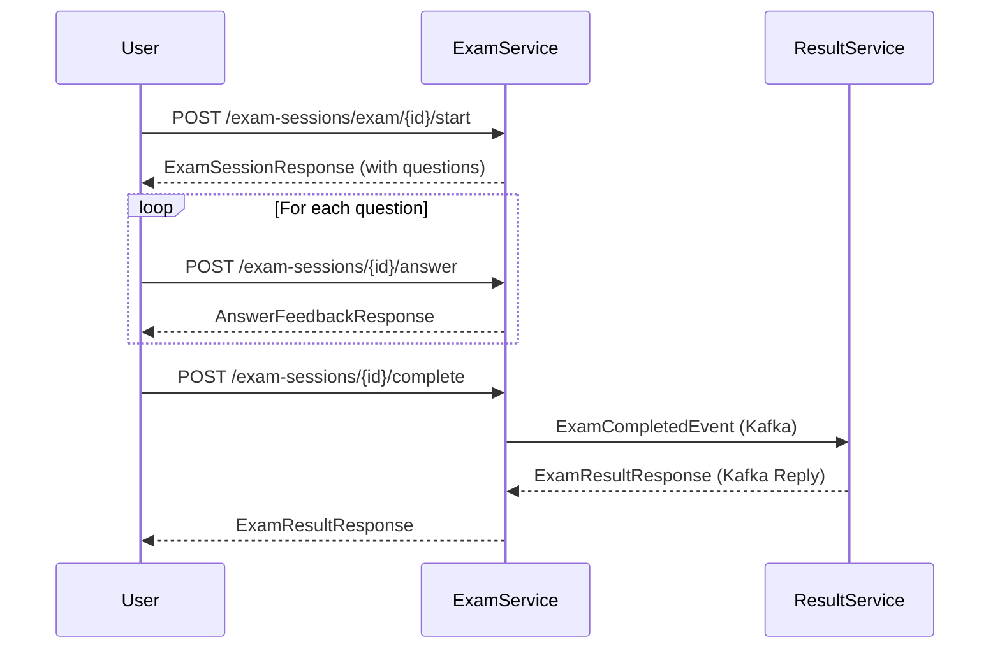

# Exam Session API Documentation

Tài liệu API chi tiết cho module Exam Session - quản lý phiên thi của người dùng.

## Thông tin chung

### Base URL
```
http://localhost:8082/api/v1/exam-sessions
```

### Authentication
- Tất cả API đều yêu cầu JWT Bearer Token
- Headers bắt buộc:
  - `Authorization: Bearer <access_token>`
  - `X-User-Id: <user_id>` (được gateway inject từ token)
  - `X-Username: <username>` (được gateway inject từ token)

### Response Format
```json
{
  "success": true,
  "message": "Optional message",
  "data": { /* Response data */ },
  "errorCode": "ERROR_CODE (only on error)",
  "timestamp": "05-01-2026T10:30:00"
}
```

---

## API Endpoints

### 1. Start Exam Session - Bắt đầu phiên thi

Tạo một phiên thi mới cho người dùng.

```
POST /api/v1/exam-sessions/exam/{examId}/start
```

**Path Parameters:**
| Parameter | Type | Description |
|-----------|------|-------------|
| examId | Long | ID của bài thi |

**Headers:**
| Header | Required | Description |
|--------|----------|-------------|
| Authorization | Yes | Bearer token |
| X-User-Id | Yes | User ID từ token |
| X-Username | Yes | Username từ token |

**Request Body:**
```json
{
  "mode": "PRACTICE"
}
```

**Validation Rules:**
- `mode`: Required, phải là `PRACTICE` hoặc `TIMED`
  - `PRACTICE`: Hiển thị đáp án đúng ngay sau khi trả lời
  - `TIMED`: Không hiển thị đáp án cho đến khi hoàn thành bài thi

**Response (201 Created):**
```json
{
  "success": true,
  "message": "Exam session started successfully",
  "data": {
    "id": 1,
    "examId": 10,
    "examTitle": "AWS Solutions Architect Associate Practice Exam",
    "certificationId": 1,
    "certificationName": "AWS Solutions Architect Associate",
    "mode": "PRACTICE",
    "status": "IN_PROGRESS",
    "startTime": "05-01-2026T10:30:00",
    "endTime": null,
    "durationMinutes": 130,
    "passingScore": 72,
    "totalQuestions": 65,
    "currentQuestionIndex": 0,
    "questions": [
      {
        "id": 101,
        "content": "A company needs to store...",
        "questionType": "SINGLE_CHOICE",
        "options": [
          {
            "id": 1001,
            "content": "Amazon S3",
            "orderIndex": 0
          },
          {
            "id": 1002,
            "content": "Amazon EBS",
            "orderIndex": 1
          }
        ],
        "topicId": 5,
        "topicName": "Storage",
        "orderIndex": 0
      }
    ],
    "createdAt": "05-01-2026T10:30:00",
    "updatedAt": "05-01-2026T10:30:00"
  }
}
```

**Error Responses:**

| Status | Error Code | Message |
|--------|------------|---------|
| 400 | ACTIVE_SESSION_EXISTS | You already have an active session (ID: X) for this exam |
| 400 | NO_QUESTIONS | This exam has no questions |
| 404 | EXAM_NOT_FOUND | Exam with ID X not found |

---

### 2. Get Session Details - Lấy thông tin phiên thi

Lấy chi tiết một phiên thi theo ID.

```
GET /api/v1/exam-sessions/{sessionId}
```

**Path Parameters:**
| Parameter | Type | Description |
|-----------|------|-------------|
| sessionId | Long | ID của phiên thi |

**Headers:**
| Header | Required | Description |
|--------|----------|-------------|
| Authorization | Yes | Bearer token |
| X-User-Id | Yes | User ID từ token |

**Response (200 OK):**
```json
{
  "success": true,
  "message": "Session retrieved successfully",
  "data": {
    "id": 1,
    "userId": 100,
    "examId": 10,
    "certificationId": 1,
    "certificationName": "AWS Solutions Architect Associate",
    "startTime": "05-01-2026T10:30:00",
    "endTime": null,
    "status": "IN_PROGRESS",
    "mode": "PRACTICE",
    "examTitle": "AWS Solutions Architect Associate Practice Exam",
    "totalQuestions": 65,
    "durationMinutes": 130,
    "answeredCount": 20,
    "correctCount": 15,
    "wrongCount": 5,
    "unansweredCount": 45,
    "flaggedCount": 3,
    "timeSpentSeconds": 1800,
    "createdAt": "05-01-2026T10:30:00",
    "updatedAt": "05-01-2026T11:00:00"
  }
}
```

**Error Responses:**

| Status | Error Code | Message |
|--------|------------|---------|
| 403 | ACCESS_DENIED | You don't have access to this session |
| 404 | SESSION_NOT_FOUND | Session with ID X not found |

---

### 3. Get Active Sessions - Lấy danh sách phiên thi đang hoạt động

Lấy tất cả phiên thi đang trong trạng thái IN_PROGRESS của người dùng.

```
GET /api/v1/exam-sessions/active
```

**Headers:**
| Header | Required | Description |
|--------|----------|-------------|
| Authorization | Yes | Bearer token |
| X-User-Id | Yes | User ID từ token |

**Response (200 OK):**
```json
{
  "success": true,
  "message": "Active sessions retrieved successfully",
  "data": [
    {
      "id": 1,
      "userId": 100,
      "examId": 10,
      "certificationId": 1,
      "certificationName": "AWS Solutions Architect Associate",
      "startTime": "05-01-2026T10:30:00",
      "endTime": null,
      "status": "IN_PROGRESS",
      "mode": "PRACTICE",
      "examTitle": "AWS Solutions Architect Associate Practice Exam",
      "totalQuestions": 65,
      "durationMinutes": 130,
      "answeredCount": 20,
      "correctCount": 15,
      "wrongCount": 5,
      "unansweredCount": 45,
      "flaggedCount": 3,
      "timeSpentSeconds": 1800,
      "createdAt": "05-01-2026T10:30:00",
      "updatedAt": "05-01-2026T11:00:00"
    }
  ]
}
```

---

### 4. Submit Answer - Gửi câu trả lời

Gửi câu trả lời cho một câu hỏi trong phiên thi.

```
POST /api/v1/exam-sessions/{sessionId}/answer
```

**Path Parameters:**
| Parameter | Type | Description |
|-----------|------|-------------|
| sessionId | Long | ID của phiên thi |

**Headers:**
| Header | Required | Description |
|--------|----------|-------------|
| Authorization | Yes | Bearer token |
| X-User-Id | Yes | User ID từ token |

**Request Body:**
```json
{
  "questionId": 101,
  "selectedOptionIds": [1001],
  "timeSpentSeconds": 45,
  "isFlagged": false
}
```

**Validation Rules:**
- `questionId`: Required, ID của câu hỏi
- `selectedOptionIds`: Required, ít nhất 1 option phải được chọn
- `timeSpentSeconds`: Optional, thời gian làm câu hỏi (>= 0)
- `isFlagged`: Optional, đánh dấu câu hỏi để xem lại

**Response - PRACTICE Mode (200 OK):**
```json
{
  "success": true,
  "message": "Answer submitted successfully",
  "data": {
    "questionId": 101,
    "answered": true,
    "isCorrect": true,
    "correctOptionIds": [1001],
    "explanation": "Amazon S3 is the best choice because...",
    "referenceLinks": null
  }
}
```

**Response - TIMED Mode (200 OK):**
```json
{
  "success": true,
  "message": "Answer submitted successfully",
  "data": {
    "questionId": 101,
    "answered": true,
    "isCorrect": null,
    "correctOptionIds": null,
    "explanation": null,
    "referenceLinks": null
  }
}
```

**Error Responses:**

| Status | Error Code | Message |
|--------|------------|---------|
| 400 | INVALID_QUESTION | Question X is not part of this session |
| 400 | SESSION_NOT_ACTIVE | This session is no longer active |
| 403 | ACCESS_DENIED | You don't have access to this session |
| 404 | SESSION_NOT_FOUND | Session with ID X not found |

---

### 5. Complete Session - Hoàn thành phiên thi

Kết thúc phiên thi và nhận kết quả chi tiết.

```
POST /api/v1/exam-sessions/{sessionId}/complete
```

**Path Parameters:**
| Parameter | Type | Description |
|-----------|------|-------------|
| sessionId | Long | ID của phiên thi |

**Headers:**
| Header | Required | Description |
|--------|----------|-------------|
| Authorization | Yes | Bearer token |
| X-User-Id | Yes | User ID từ token |

**Response (200 OK):**
```json
{
  "success": true,
  "message": "Exam session completed successfully",
  "data": {
    "resultId": 1,
    "sessionId": 1,
    "userId": 100,
    "examId": 10,
    "examTitle": "AWS Solutions Architect Associate Practice Exam",
    "totalQuestions": 65,
    "correctAnswers": 50,
    "wrongAnswers": 10,
    "unanswered": 5,
    "score": 50.00,
    "percentage": 76.92,
    "passStatus": "PASSED",
    "passingScore": 72,
    "timeTakenSeconds": 5400,
    "completedAt": "05-01-2026T12:00:00",
    "topicPerformances": [
      {
        "topicId": 5,
        "topicName": "Storage",
        "totalQuestions": 15,
        "correctAnswers": 12,
        "percentage": 80.00
      },
      {
        "topicId": 6,
        "topicName": "Compute",
        "totalQuestions": 20,
        "correctAnswers": 16,
        "percentage": 80.00
      }
    ],
    "questionResults": [
      {
        "questionId": 101,
        "questionText": "A company needs to store...",
        "userAnswerIds": [1001],
        "correctAnswerIds": [1001],
        "isCorrect": true,
        "timeSpentSeconds": 45,
        "explanation": "Amazon S3 is the best choice because...",
        "reference": "https://docs.aws.amazon.com/s3/"
      },
      {
        "questionId": 102,
        "questionText": "Which service provides...",
        "userAnswerIds": [1005],
        "correctAnswerIds": [1006],
        "isCorrect": false,
        "timeSpentSeconds": 60,
        "explanation": "The correct answer is EC2 because...",
        "reference": "https://docs.aws.amazon.com/ec2/"
      }
    ],
    "success": true,
    "errorMessage": null
  }
}
```

**Error Responses:**

| Status | Error Code | Message |
|--------|------------|---------|
| 400 | SESSION_NOT_ACTIVE | This session is no longer active |
| 400 | CALCULATION_ERROR | Result calculation timed out. Please try again. |
| 403 | ACCESS_DENIED | You don't have access to this session |
| 404 | SESSION_NOT_FOUND | Session with ID X not found |

---

## Data Models

### Session Status
| Value | Description |
|-------|-------------|
| IN_PROGRESS | Phiên thi đang diễn ra |
| COMPLETED | Phiên thi đã hoàn thành |
| ABANDONED | Phiên thi bị hủy bỏ |
| TIMED_OUT | Phiên thi hết thời gian |

### Exam Mode
| Value | Description |
|-------|-------------|
| PRACTICE | Chế độ luyện tập - hiển thị đáp án ngay sau khi trả lời |
| TIMED | Chế độ thi thật - không hiển thị đáp án cho đến khi hoàn thành |

### Pass Status
| Value | Description |
|-------|-------------|
| PASSED | Đạt điểm đậu |
| FAILED | Không đạt điểm đậu |

---

## Workflow

### Luồng thi cơ bản



### Luồng xử lý answer

1. **PRACTICE Mode:**
   - Gửi answer → Nhận feedback ngay (isCorrect, correctOptionIds, explanation)
   - Có thể thay đổi answer và nhận feedback mới

2. **TIMED Mode:**
   - Gửi answer → Chỉ nhận xác nhận đã lưu (isCorrect = null)
   - Có thể thay đổi answer nhưng không biết đúng/sai
   - Chỉ nhận kết quả chi tiết khi complete session

---

## TypeScript Interfaces

```typescript
// Request Types
interface StartExamRequest {
  mode: 'PRACTICE' | 'TIMED';
}

interface AnswerQuestionRequest {
  questionId: number;
  selectedOptionIds: number[];
  timeSpentSeconds?: number;
  isFlagged?: boolean;
}

// Response Types
interface ExamSessionResponse {
  id: number;
  examId: number;
  examTitle: string;
  certificationId: number;
  certificationName: string;
  mode: 'PRACTICE' | 'TIMED';
  status: 'IN_PROGRESS' | 'COMPLETED' | 'ABANDONED' | 'TIMED_OUT';
  startTime: string;
  endTime?: string;
  durationMinutes: number;
  passingScore: number;
  totalQuestions: number;
  currentQuestionIndex: number;
  questions: QuestionResponse[];
  createdAt: string;
  updatedAt: string;
}

interface UserExamSessionResponse {
  id: number;
  userId: number;
  examId: number;
  certificationId: number;
  certificationName: string;
  startTime: string;
  endTime?: string;
  status: string;
  mode: string;
  examTitle: string;
  totalQuestions: number;
  durationMinutes: number;
  answeredCount: number;
  correctCount: number;
  wrongCount: number;
  unansweredCount: number;
  flaggedCount: number;
  timeSpentSeconds: number;
  createdAt: string;
  updatedAt: string;
}

interface AnswerFeedbackResponse {
  questionId: number;
  answered: boolean;
  isCorrect?: boolean;
  correctOptionIds?: number[];
  explanation?: string;
  referenceLinks?: string[];
}

interface ExamResultResponse {
  resultId: number;
  sessionId: number;
  userId: number;
  examId: number;
  examTitle: string;
  totalQuestions: number;
  correctAnswers: number;
  wrongAnswers: number;
  unanswered: number;
  score: number;
  percentage: number;
  passStatus: 'PASSED' | 'FAILED';
  passingScore: number;
  timeTakenSeconds: number;
  completedAt: string;
  topicPerformances: TopicPerformanceData[];
  questionResults: QuestionResultData[];
  success: boolean;
  errorMessage?: string;
}

interface TopicPerformanceData {
  topicId: number;
  topicName: string;
  totalQuestions: number;
  correctAnswers: number;
  percentage: number;
}

interface QuestionResultData {
  questionId: number;
  questionText: string;
  userAnswerIds: number[];
  correctAnswerIds: number[];
  isCorrect: boolean;
  timeSpentSeconds: number;
  explanation: string;
  reference: string;
}

interface QuestionResponse {
  id: number;
  content: string;
  questionType: string;
  options: QuestionOptionResponse[];
  topicId: number;
  topicName: string;
  orderIndex: number;
}

interface QuestionOptionResponse {
  id: number;
  content: string;
  orderIndex: number;
}
```

---

## Error Codes Reference

| Error Code | HTTP Status | Description |
|------------|-------------|-------------|
| EXAM_NOT_FOUND | 404 | Bài thi không tồn tại |
| SESSION_NOT_FOUND | 404 | Phiên thi không tồn tại |
| ACTIVE_SESSION_EXISTS | 400 | Đã có phiên thi đang hoạt động cho bài thi này |
| SESSION_NOT_ACTIVE | 400 | Phiên thi không còn hoạt động |
| ACCESS_DENIED | 403 | Không có quyền truy cập phiên thi này |
| INVALID_QUESTION | 400 | Câu hỏi không thuộc phiên thi này |
| NO_QUESTIONS | 400 | Bài thi không có câu hỏi |
| CALCULATION_ERROR | 500 | Lỗi tính toán kết quả |

---

## Kafka Events (Internal)

### ExamCompletedEvent
Được gửi từ exam-service đến result-service khi phiên thi hoàn thành.

```json
{
  "sessionId": 1,
  "userId": 100,
  "examId": 10,
  "certificationId": 1,
  "mode": "PRACTICE",
  "examTitle": "AWS Solutions Architect Associate Practice Exam",
  "totalQuestions": 65,
  "durationMinutes": 130,
  "passingScore": 72,
  "startTime": "2026-01-05T10:30:00",
  "endTime": "2026-01-05T12:00:00",
  "answeredCount": 60,
  "correctCount": 50,
  "wrongCount": 10,
  "flaggedCount": 3,
  "timeSpentSeconds": 5400,
  "answers": [
    {
      "questionId": 101,
      "topicId": 5,
      "topicName": "Storage",
      "selectedOptionIds": [1001],
      "correctOptionIds": [1001],
      "isCorrect": true,
      "isFlagged": false,
      "timeSpentSeconds": 45,
      "answeredAt": "2026-01-05T10:35:00",
      "questionText": "A company needs to store...",
      "explanation": "Amazon S3 is the best choice because...",
      "reference": "https://docs.aws.amazon.com/s3/"
    }
  ],
  "eventTime": "2026-01-05T12:00:00"
}
```

### ExamResultResponse (Kafka Reply)
Được gửi từ result-service về exam-service sau khi tính toán kết quả.

(Xem cấu trúc trong phần Response của Complete Session API)
